# Task-Similarity PD Defection - Architecture Overview

This package (`auto_experiments.task_similarity`) is a small, self-contained experiment harness that studies how Prisoner's Dilemma (PD) **defection** vs **cooperation** is represented in a Qwen-style causal language model, and how that internal direction transfers to downstream game-theory benchmarks.

At a high level, the pipeline is:

1. **Build PD prompt pairs**  
   - Source data: `data_creation/scenario_creation/langgraph_creation/Prisoners_Dilemma_all_data_samples.json` (shared with the main project).  
   - Logic in `pd_prompt_builder.py` and `pd_data.py` constructs matched **positive** (defect) and **negative** (cooperate) prompts with randomized option ordering.

2. **Extract span-based hidden representations**  
   - `pd_hidden_extractor.collect_answer_means` runs the HF model with `output_hidden_states=True` and mean-pools activations over the Assistant's answer span (by default, just the `"LABEL) ANSWER"` option text).

3. **Train per-layer "defection vectors"**  
   - `run_pd_defection_experiment.train_pd_repreader` computes, for each transformer layer, a PCA direction of `defect - cooperate` differences across prompt pairs, and orients it so positive projection corresponds to defection on held-out test pairs.

4. **Evaluate behavior on the PD data itself**  
   - `run_pd_defection_experiment.run` measures how often the base model's logits choose the defection option vs cooperation on PD test prompts (decision rate).  
   - It then adds the learned vector as a constant offset to hidden states via a forward hook (`_register_control_hook`) at different intensities and re-measures defection rate.

5. **Transfer to a game-theory benchmark**  
   - `run_pd_defection_pd_behavior.run` loads a **PDActivationSpec** (location, layer, vector, training seed) and a `BenchmarkConfig` from `config/pd_behavior_game_theory.yaml`.  
   - It constructs a `GameTheoryDataset` for the `game_theory` / `Prisoners_Dilemma` task, filters it down to the same PD test scenarios, and measures how the defection ratio changes when steering with the PD defection vector.

6. **Optional: delta-activation analysis**  
   - `compute_pd_delta.run_delta` probes how the same vector changes mean activations on a fixed set of generic prompts, using `delta_activation_engine` utilities.

7. **Optional: emotion-vs-PD delta similarity (sample-level)**  
   - `emotion_pd_delta_similarity.py` measures **sample-level** per-layer similarity between two *effects* on the model:
     - Δ activations caused by **emotion RepReader steering** (`--emotion`, default `anger`), and
     - Δ activations caused by **PD defection steering**.
  - Dataset split selection:
     - Default `--split all` runs on all benchmark PD samples (no filtering).
     - Use `--split test` / `--split train` to filter prompts by `split_manifest.json`.
   - Uses **last non-pad token hidden state** (no generation) and applies per-layer steering on the **middle-third layers** (e.g. 12..23 for 36-layer Qwen2.5-3B), while measuring all layers.
   - Output directory contains both `.npy` tensors and CSVs:
     - `cosines.npy`: `(n_intensities, n_samples, n_layers)` with `cos(Δ_l^anger(x), Δ_l^pd(x))`
     - `samples.csv`: `item_id,prompt` for traceability
     - `cosines.csv`: long-form table `item_id,intensity,layer,controlled,cosine,...` for analysis in pandas/R
   - Output layout uses a run identifier (typically datetime) as the top-level folder:
     - `results/emotion_pd_delta_similarity/<run_id>/<model>/<emotion>/seed_<seed>/`
   - The multi-emotion pipeline writes a reproducibility snapshot at:
     - `results/emotion_pd_delta_similarity/<run_id>/config.json`

8. **Optional: decision-impact analysis (similarity → behavior)**  
   - `analyze_similarity_decision_impact.py` joins a similarity run with an EmotionExperiment result folder (expects `detailed_results.csv`, and uses `raw_results.json` to attach sample text).
   - Writes:
     - `samples_with_decision.csv`: `item_id,intensity,behavior,defect,prompt,response`
     - `layer_impact_summary.csv`: per `(intensity,layer)` association stats (`mean_cos_defect`, `mean_cos_cooperate`, `pearson_r(defect,cosine)`)
   - Note: the join key is `(item_id,intensity)`; if the benchmark run uses prompt augmentation (e.g. shuffled options), the prompt strings can differ while `item_id` stays aligned.
  - A convenience runner for multiple emotions exists: `python -m auto_experiments.task_similarity.run_emotion_pd_similarity_pipeline` (and the thin wrapper `run_emotion_pd_similarity_pipeline.sh`).

## Modules and Responsibilities

- `pd_prompt_builder.py`  
  Build PD prompts with randomized option ordering and paired Assistant answers, plus inference prompts for choice prediction.

- `pd_data.py`  
  Load PD JSON, build `PromptPair` objects, perform deterministic train/test splits, and construct RepReader-style datasets (`{"data": [...], "labels": [[1, 0], ...]}`).

- `pd_hidden_extractor.py`  
  Extract mean-pooled hidden states over the Assistant answer span (or option span) for specified transformer layers.

- `pd_vector_extractor.py`  
  Compute per-layer defection vectors and validation accuracies from hidden states (diff-of-means baseline; currently mainly used as an alternative to the PCA logic in `run_pd_defection_experiment`).

- `run_pd_defection_experiment.py`  
  Main **training** entry point: constructs PD pairs, trains per-layer defection vectors via PCA, evaluates PD decision rates with/without steering, and writes run artifacts under `results/`.

- `run_pd_defection_pd_behavior.py`  
  Main **behavior-transfer** entry point: given a PD activation spec and a benchmark config, measures how steering affects defection ratios in the `game_theory` benchmark.

- `compute_pd_delta.py`  
  Auxiliary entry point: computes baseline vs steered hidden activations on generic probes and saves their deltas for analysis.

- `config/`  
  - `pd_behavior_game_theory.yaml`: benchmark configuration for the `game_theory` / `Prisoners_Dilemma` task.  
  - `pd_defection_iter8_qwen2.5_0.5B.json` and related: PD activation specs pointing at previous PD runs and the chosen layer/vector to reuse.

- `tests/`  
  - `test_pd_data.py`: invariants for pair splitting and RepReader dataset layout.  
  - `test_pd_hidden_extractor.py`: ensures assistant spans are identified correctly and truncation is guarded.  
  - `test_pd_run_smoke.py`: smoke-tests `run_pd_defection_experiment.run` with dummy models.  
  - `test_pd_behavior_run_smoke.py`: smoke-tests `run_pd_defection_pd_behavior.run` with dummy HF and benchmark components.

## High-Level Data and Control Flow

```mermaid
flowchart LR
  subgraph PDTraining["PD Defection Training (run_pd_defection_experiment)"]
    PDJSON["Prisoners_Dilemma_all_data_samples.json"] --> PDData["pd_data.build_pd_pair_bundle"]
    PDData --> Prompts["pd_prompt_builder.PromptPair"]
    Prompts --> RepDS["build_repreader_dataset\n(train/test)"]
    RepDS --> Hidden["pd_hidden_extractor.collect_answer_means"]
    Hidden --> PCA["train_pd_repreader (per-layer PCA)"]
    PCA --> Vectors["layer_vectors{layer -> defection vector}"]
    PCA --> Metrics["layer_accuracies\nbest_layer, best_accuracy"]
    Vectors --> Hooks["_register_control_hook\n(per layer, per intensity)"]
    Hooks --> PDDecision["_decision_rate\n(base vs steered)"]
  end

  subgraph PDBehavior["PD Behavior Transfer (run_pd_defection_pd_behavior)"]
    Vectors --> Spec["PDActivationSpec\n(config/*.json)"]
    Spec --> BehaviorRun["run_pd_defection_pd_behavior.run"]
    BehaviorRun --> GTConfig["pd_behavior_game_theory.yaml -> BenchmarkConfig"]
    GTConfig --> GTData["GameTheoryDataset(game_theory/PD)"]
    GTData --> Restrict["_restrict_dataset_to_pd_test_split"]
    Restrict --> DefectRatio["_compute_defect_ratio\n(base vs steered)"]
  end

  subgraph Delta["Delta Activations (compute_pd_delta)"]
    Vectors --> DeltaRun["compute_pd_delta.run_delta"]
    DeltaRun --> Probes["get_generic_probes()"]
    Probes --> HiddenDelta["_collect_hidden\n(baseline vs steered)"]
    HiddenDelta --> DeltaFiles["delta.npz"]
  end
```

This design is intentionally **narrow and local**:

- All PD-specific logic lives inside `auto_experiments.task_similarity` and does not modify shared infrastructure like `neuro_manipulation` or the main benchmark engine.  
- Steering uses simple additive hooks into `model.model.layers[lyr]`, avoiding any entanglement with other hook systems.  
- Data dependencies are explicit (paths passed as arguments or in small JSON/YAML configs) rather than inferred from global state.
