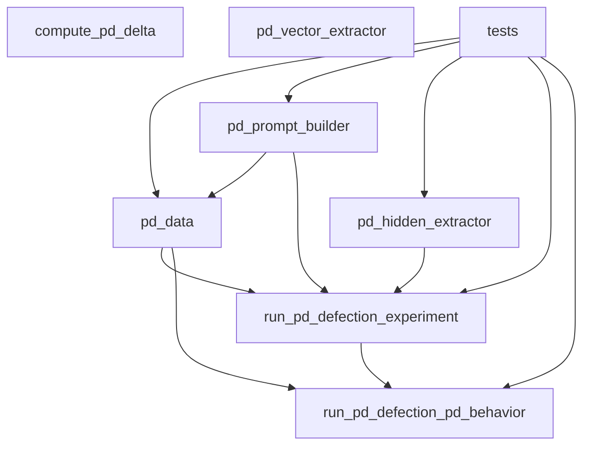
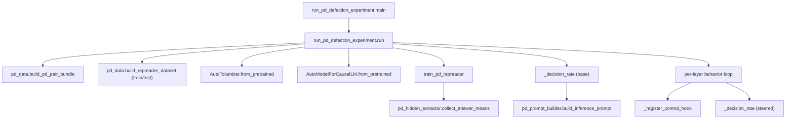
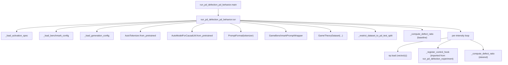
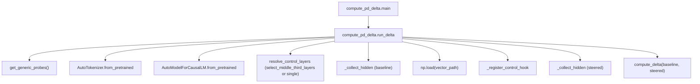

# Task-Similarity PD Defection - Modules, Dependencies, and Call Graphs

This document maps how the main modules in `auto_experiments.task_similarity` depend on each other and how control flows through the key entry points.

## Module Dependency Graph

At the package level:

Rough layering:

- **Base utilities**: `pd_prompt_builder`, `pd_data`, `pd_hidden_extractor`, `pd_vector_extractor`.  
- **Experiment entry points**: `run_pd_defection_experiment`, `compute_pd_delta`.  
- **Benchmark transfer entry point**: `run_pd_defection_pd_behavior`.  
- **Validation**: `tests/` and the config files under `config/`.

There are no cycles between internal modules; higher-level code depends on lower-level utilities only.

## External Dependencies (Conceptual)

- HuggingFace Transformers (`AutoModelForCausalLM`, `AutoTokenizer`)  
  Used by all entry points to load Qwen-style causal models and tokenizers.

- `emotion_experiment_engine`  
  - `data_models.BenchmarkConfig`  
  - `datasets.games.GameTheoryDataset`  
  - `game_prompt_wrapper.GameBenchmarkPromptWrapper`  
  Used exclusively by `run_pd_defection_pd_behavior` to construct and iterate over the `game_theory` benchmark.
- `emotion_experiment_engine`  
  - `data_models.BenchmarkConfig`  
  - `datasets.games.GameTheoryDataset`  
  - `game_prompt_wrapper.GameBenchmarkPromptWrapper`  
  Used exclusively by `run_pd_defection_pd_behavior` to construct and iterate over the `game_theory` benchmark.

- `neuro_manipulation.prompt_formats.PromptFormat`  
  Used by `run_pd_defection_pd_behavior` to build prompts consistent with the main project's chat formatting.

- `delta_activation_engine`  
  - `prompts.probes_texts.get_generic_probes`  
  - `backends.hf.select_middle_third_layers`  
  Used exclusively by `compute_pd_delta`.

## Call Graph - PD Training (`run_pd_defection_experiment`)

Key flows:

1. **Data prep**: PD JSON -> `PDPairBundle` -> RepReader datasets.  
2. **Representation learning**: span-mean hidden states -> PCA -> per-layer vectors.  
3. **PD behavior evaluation**: logit comparison on PD prompts with/without hooks.

## Call Graph - PD Behavior Transfer (`run_pd_defection_pd_behavior`)

Key flows:

1. **Config loading**: activation spec JSON + benchmark YAML -> `PDActivationSpec` + `BenchmarkConfig`.  
2. **Dataset construction**: `GameTheoryDataset` for task `Prisoners_Dilemma`, filtered to align with the PD training test split.  
3. **Behavior evaluation**: defection ratios vs intensities, with optional multi-layer ("middle third") steering.

## Call Graph - Delta Activations (`compute_pd_delta`)

This entry point is intentionally orthogonal: it does not touch PD data or the game-theory benchmark, only the defection vector and a fixed set of generic probes.

## Test-Level Call Relationships

The tests provide good examples of how to wire the components while keeping external dependencies mocked out:

- `tests/test_pd_data.py`  
  Exercises `build_repreader_dataset` and `split_pairs` purely in memory.

- `tests/test_pd_hidden_extractor.py`  
  Uses dummy tokenizers/models to validate `collect_answer_means` behavior and truncation assertions.

- `tests/test_pd_run_smoke.py`  
  Patches:
  - `build_pd_pair_bundle`  
  - `AutoTokenizer.from_pretrained`  
  - `AutoModelForCausalLM.from_pretrained`  
  - `train_pd_repreader`  
  - `_decision_rate`, `_register_control_hook`, `_token_id`  
  to ensure `run()` produces coherent results and saves vectors/metrics without any real HF calls.

- `tests/test_pd_behavior_run_smoke.py`  
  Patches:
  - Tokenizer/model factories  
  - `PromptFormat`, `GameTheoryDataset`, `_register_control_hook`  
  to ensure `run_pd_defection_pd_behavior.run` behaves correctly and that defection ratios monotonically react to the dummy steering signal.

These tests are useful references if you need to add new behavior without immediately bringing in real models or the full benchmark engine.
