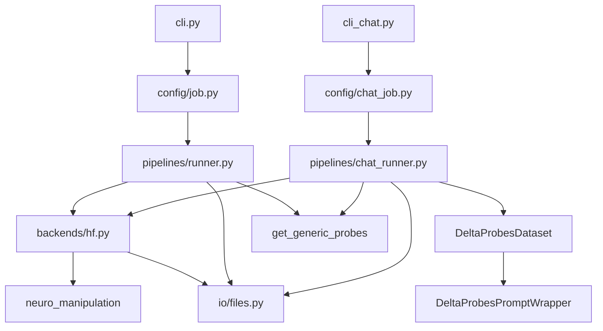

# Dependency and Call Diagrams
Last updated: 2024-03-19 (working copy)

## Module Dependency (simplified)


## Call Graph — Baseline Pipeline
```mermaid
flowchart TD
    A[cli.main] --> B[load_job_config_from_yaml]
    B --> C[HFBackend(cfg)]
    C --> D[run_job(cfg, backend)]
    D --> E[get_generic_probes]
    D --> F[backend.get_repr(prompts, steered=False)]
    D --> G[save_npz_vector(baseline)]
    D --> H[save_json(metadata)]
    D --> I{for emotion,intensity}
    I --> J[backend.get_repr(steered=True,...)]
    J --> K[delta = steered - baseline]
    K --> L[save_npz_vector(delta)]
```

## Call Graph — Chat-Aware Pipeline
```mermaid
flowchart TD
    A[cli_chat.main] --> B[load_chat_job_config_from_yaml]
    B --> C[run_job_chat(cfg)]
    C --> D[load_tokenizer_only + PromptFormat]
    D --> E[DeltaProbesPromptWrapper]
    E --> F[DeltaProbesDataset]
    F --> G[_collect_prompts(dataset)]
    C --> H[HFBackend(cfg) if backend None]
    C --> I[backend.get_repr(prompts, steered=False)]
    I --> J[save_npz_vector(baseline)]
    C --> K[save_json(metadata)]
    C --> L{for emotion,intensity}
    L --> M[backend.get_repr(steered=True,...)]
    M --> N[delta = steered - baseline]
    N --> O[save_npz_vector(delta)]
```

Notes:
- Both pipelines share HFBackend and IO utilities; chat pipeline adds prompt rendering through PromptFormat and Dataset wrappers.
- Backends depend on `neuro_manipulation` for HF setup, RepE readers, and controller wrapping.
