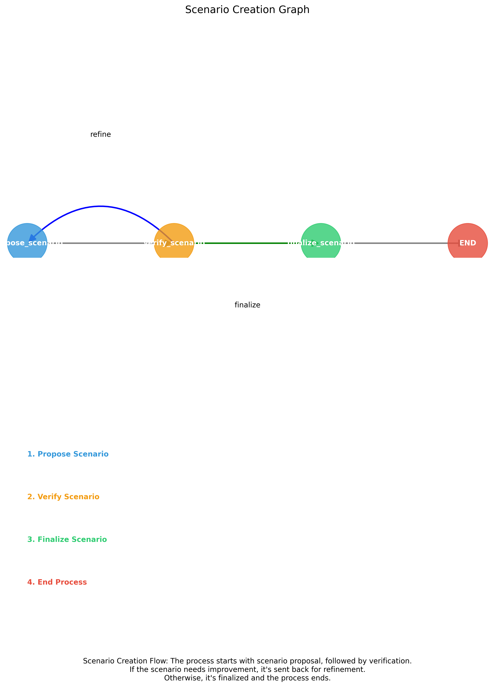

# Scenario Creation Graph

This document explains the LangGraph-based scenario creation process for game theory experiments.

## Overview

The Scenario Creation Graph automates the process of creating realistic scenarios for game theory experiments. It uses LangGraph to orchestrate a multi-step workflow that:

1. Proposes initial scenario drafts based on requirements
2. Verifies that scenarios properly implement game theory structures
3. Refines scenarios based on feedback
4. Repeats the cycle until convergence or max iterations



## Architecture

The graph consists of the following components:

### State

The state object (`ScenarioCreationState`) tracks:
- Input requirements (game name, participants, jobs)
- Working data (current scenario draft, feedback, iteration count)
- Output (final scenario, convergence status)

### Nodes

1. **Propose Scenario** (`propose_scenario`)
   - Creates or refines scenario drafts based on game requirements
   - Uses previous feedback for refinement in later iterations
   - Ensures proper JSON structure matching the game type

2. **Verify Scenario** (`verify_scenario`)
   - Evaluates if the scenario properly implements the game theory structure
   - Checks if the scenario mask is effective (players won't immediately recognize the game)
   - Provides specific feedback for improvement
   - Determines if the scenario has converged (no more improvements needed)

3. **Finalize Scenario** (`finalize_scenario`)
   - Saves the final scenario to a file
   - Adds metadata and timestamps
   - Returns the completed scenario

### Edges and Flow Control

The graph uses conditional edges to determine the flow:
- After verification, the `should_continue` function decides whether to:
  - Refine the scenario (loop back to proposal)
  - Finalize the scenario (proceed to saving)

The process stops when either:
- The scenario has converged (no more improvements needed)
- Max iterations have been reached (default: 5)

## Reliable JSON Response Handling

The implementation uses OpenAI's structured JSON response feature to ensure reliable parsing:

1. **Automatic JSON Response Format**: All LLM calls use `response_format={"type": "json_object"}` to ensure responses are valid JSON.
2. **Simplified Parsing**: This eliminates the need for complex regex extraction from markdown code blocks.
3. **Error Handling**: Even with JSON mode enabled, we still have fallback error handling for any unexpected issues.

This approach makes the system more robust and reduces the likelihood of parsing errors or malformed scenarios.

## Usage

```python
from scenario_creation_graph import create_scenario

# Create a Prisoner's Dilemma scenario
scenario = create_scenario(
    game_name="Prisoners_Dilemma",
    participants=["Alice", "Bob"],
    participant_jobs=["Software Developer", "Project Manager"]
)

# Print the created scenario
import json
print(json.dumps(scenario, indent=2))
```

## Integration with Existing Code

This LangGraph implementation provides an alternative to the existing AutoGen-based scenario generation in `data_creation/create_scenario.py`. It offers several advantages:

1. **Iterative Refinement**: Automatically improves scenarios through multiple iterations
2. **Quality Control**: Verifies scenarios meet requirements before finalizing
3. **Transparency**: Provides feedback at each step of the process
4. **Flexibility**: Can be extended with additional verification steps or criteria

## Extension Points

The graph can be extended in several ways:

1. Add more verification criteria in the `verify_scenario` function
2. Implement human-in-the-loop feedback by adding a human verification node
3. Add specialized nodes for different game types
4. Integrate with other systems through additional output nodes 