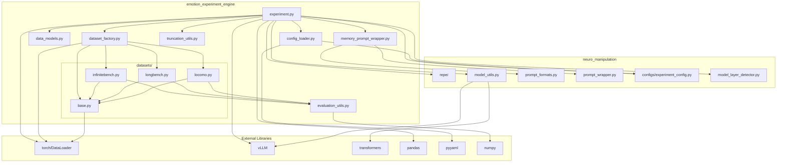

# Dependencies and Module Relationships Analysis

## Overview

The emotion memory experiments module operates within a complex ecosystem of internal and external dependencies. This analysis maps the complete dependency graph, examines critical relationships, and identifies architectural coupling points that influence system behavior, maintainability, and evolution potential.

## Dependency Architecture



## Internal Module Dependencies

### **Core Orchestration Layer**

#### **experiment.py Dependencies**
```python
# emotion_experiment_engine/experiment.py

# Internal module dependencies
from .dataset_factory import create_dataset_from_config
from .truncation_utils import calculate_max_context_length
from .data_models import DEFAULT_GENERATION_CONFIG, ExperimentConfig, ResultRecord
from .memory_prompt_wrapper import get_memory_prompt_wrapper

# Neural manipulation framework dependencies
from neuro_manipulation.configs.experiment_config import get_repe_eng_config
from neuro_manipulation.model_layer_detector import ModelLayerDetector
from neuro_manipulation.model_utils import (
    load_emotion_readers,
    setup_model_and_tokenizer,
)
from neuro_manipulation.repe.pipelines import get_pipeline

# External dependencies
import pandas as pd
import torch
from torch.utils.data import DataLoader
from vllm import LLM
```

**Dependency Analysis**:
- **High Coupling**: Heavy dependency on neuro_manipulation framework (5 imports)
- **Clean Separation**: Dataset creation abstracted through factory
- **External Integration**: Direct PyTorch and vLLM usage for performance
- **Data Management**: Pandas for result analysis and export

### **Dataset Factory Layer**

#### **dataset_factory.py Dependencies**
```python
# emotion_experiment_engine/dataset_factory.py

from typing import Dict, Type, Any, List, Optional, Callable
from pathlib import Path

# Internal dependencies
from .data_models import BenchmarkConfig
from .datasets.base import BaseBenchmarkDataset

# Specialized dataset imports
from .datasets.infinitebench import InfiniteBenchDataset
from .datasets.longbench import LongBenchDataset  
from .datasets.locomo import LoCoMoDataset
```

**Dependency Characteristics**:
- **Minimal External**: Only standard library dependencies
- **Registry Pattern**: Direct imports of all specialized datasets
- **Type Safety**: Comprehensive typing annotations
- **Interface Adherence**: All specialized datasets must implement BaseBenchmarkDataset

### **Base Dataset Layer**

#### **datasets/base.py Dependencies**
```python
# emotion_experiment_engine/datasets/base.py

import json
from abc import ABC, abstractmethod
from pathlib import Path
from typing import Any, Dict, List, Optional, Callable

from torch.utils.data import Dataset

# Internal dependencies
from ..data_models import BenchmarkConfig, BenchmarkItem
```

**Design Principles**:
- **Minimal Dependencies**: Only essential PyTorch Dataset inheritance
- **Standard Library Focus**: JSON, pathlib, typing for core functionality
- **Abstract Interface**: Forces implementation consistency across specialized classes

### **Specialized Dataset Dependencies**

#### **InfiniteBench Dataset**
```python
# emotion_experiment_engine/datasets/infinitebench.py

from typing import Any, Dict, List
# Internal dependencies
from ..data_models import BenchmarkConfig, BenchmarkItem
from ..evaluation_utils import get_score_one
from .base import BaseBenchmarkDataset

# Import all evaluation utilities
from .. import evaluation_utils
```

**Evaluation Routing Pattern**:
```python
class InfiniteBenchDataset:
    # Static mapping eliminates runtime dependencies
    TASK_EVALUATORS = {
        "passkey": "get_score_one_passkey",
        "kv_retrieval": "get_score_one_kv_retrieval",
        "math_find": "get_score_one_math_find",
        # ... 12 total task types
    }
    
    def _route_to_evaluator(self, task_name, response, ground_truth):
        """Dynamic function lookup without import dependencies"""
        evaluator_func = getattr(evaluation_utils, evaluator_name)
        return evaluator_func(response, ground_truth, "emotion_model")
```

## Neural Manipulation Framework Dependencies

### **RepE Integration Dependencies**

#### **Emotion Reader Extraction**
```python
# Dependency chain for emotion activation
neuro_manipulation.model_utils.load_emotion_readers()
└── neuro_manipulation.repe.rep_readers.RepReader
    ├── neuro_manipulation.repe.rep_control_reading_vec.py
    ├── neuro_manipulation.repe.rep_control_contrast_vec.py
    └── neuro_manipulation.model_layer_detector.ModelLayerDetector
```

#### **Control Pipeline Dependencies**
```python
# RepE control pipeline dependency tree
neuro_manipulation.repe.pipelines.get_pipeline()
├── "rep-control-vllm" → rep_control_vllm.py
│   ├── vLLM LLM integration
│   └── tensor manipulation utilities
└── "rep-control" → rep_control_pipeline.py
    ├── HuggingFace model integration
    └── forward hook manipulation
```

### **Model Loading Dependencies**

#### **Two-Stage Loading Pattern**
```python
# Stage 1: HuggingFace model loading
neuro_manipulation.model_utils.setup_model_and_tokenizer(from_vllm=False)
├── transformers.AutoModel
├── transformers.AutoTokenizer  
├── transformers.AutoProcessor  # For multi-modal models
└── torch model loading utilities

# Stage 2: vLLM model loading  
neuro_manipulation.model_utils.setup_model_and_tokenizer(from_vllm=True)
├── vllm.LLM
├── vllm.SamplingParams
└── vllm configuration management
```

### **Prompt Formatting Dependencies**

#### **Inheritance Chain**
```python
# Prompt wrapper inheritance hierarchy
emotion_experiment_engine.memory_prompt_wrapper.MemoryPromptWrapper
└── neuro_manipulation.prompt_wrapper.PromptWrapper
    ├── neuro_manipulation.prompt_formats.PromptFormat
    │   ├── Model-specific formats (Qwen, ChatML, etc.)
    │   └── Template handling utilities
    └── neuro_manipulation thinking mode support
```

## External Library Dependencies

### **Core ML/AI Stack**

#### **PyTorch Ecosystem**
```python
# PyTorch integration points
torch:
├── tensor operations for activation vectors
├── device management (CPU/CUDA)
├── DataLoader integration for batching
└── memory management utilities

torch.utils.data:
├── Dataset interface implementation
├── DataLoader batch processing
└── custom collation functions
```

#### **vLLM Integration**
```python
# vLLM dependencies and usage
vllm:
├── LLM class for model inference
├── SamplingParams for generation control
├── RequestOutput for response handling
└── distributed inference support

# Memory experiment specific usage
def _infer_with_activation(self, rep_reader, data_loader):
    control_outputs = self.rep_control_pipeline(
        batch["prompt"],
        activations=activations,  # PyTorch tensors
        **generation_params      # vLLM SamplingParams
    )
    # Returns: List[RequestOutput] from vLLM
```

#### **HuggingFace Transformers**
```python
# HuggingFace integration through framework
transformers:
├── AutoModel for layer access
├── AutoTokenizer for text processing
├── AutoProcessor for multi-modal support
└── model configuration utilities

# Used indirectly through neuro_manipulation.model_utils
model, tokenizer, prompt_format, processor = setup_model_and_tokenizer(
    loading_config, from_vllm=False
)
```

### **Data Processing Stack**

#### **Pandas Integration**
```python
# Pandas usage for result analysis
pandas:
├── DataFrame creation from ResultRecord objects
├── statistical analysis (groupby, agg)
├── CSV export functionality
└── data manipulation utilities

# Example usage
summary = (
    df.groupby(["emotion", "intensity"])
    .agg({"score": ["mean", "std", "count", "min", "max"]})
    .round(4)
)
```

#### **Data Format Dependencies**
```python
# Standard library dependencies for data handling
json:
├── JSONL benchmark data loading
├── configuration serialization
└── result export formatting

yaml:
├── experiment configuration loading
├── parameter validation
└── nested configuration parsing

pathlib:
├── cross-platform path handling
├── file existence checking
└── directory creation utilities
```

## Dependency Analysis by Component

### **Configuration System Dependencies**

#### **config_loader.py Dependency Tree**
```
config_loader.py
├── yaml (external) - Configuration file parsing
├── pathlib (stdlib) - Path handling  
├── typing (stdlib) - Type annotations
├── data_models (internal) - Configuration dataclasses
└── neuro_manipulation.configs (framework) - RepE configuration
```

**Coupling Analysis**:
- **Low External Coupling**: Only YAML library dependency
- **Medium Framework Coupling**: Leverages framework configuration utilities
- **High Internal Coupling**: Tightly integrated with data models

### **Evaluation System Dependencies**

#### **evaluation_utils.py Dependency Tree**
```
evaluation_utils.py
├── re (stdlib) - Regular expression processing
├── string (stdlib) - Text normalization
├── json (stdlib) - Data structure handling
├── collections.Counter (stdlib) - Token counting
└── typing (stdlib) - Type annotations
```

**Design Strength**:
- **Zero External Dependencies**: Uses only standard library
- **Self-Contained**: All evaluation functions independent
- **Scientific Integrity**: Direct replication of original paper methods

### **Memory Management Dependencies**

#### **truncation_utils.py Dependency Analysis**
```python
# emotion_experiment_engine/truncation_utils.py

def calculate_max_context_length(
    max_model_len: int,
    preserve_ratio: float = 0.95,
    prompt_overhead: int = 200
) -> int:
    """Calculate maximum context length for truncation"""
    # Pure computation - no external dependencies
    return int((max_model_len - prompt_overhead) * preserve_ratio)
```

**Dependency Characteristics**:
- **No External Dependencies**: Pure computational functions
- **Framework Integration**: Used by experiment.py for context management
- **Configurable Parameters**: Supports different truncation strategies

## Critical Dependency Analysis

### **High-Risk Dependencies**

#### **1. vLLM Engine Dependency**
```python
# Risk: vLLM API changes could break inference
# Mitigation: Abstract through neuro_manipulation framework
from vllm import LLM

# Framework abstraction reduces direct coupling
model, tokenizer, prompt_format, _ = setup_model_and_tokenizer(
    loading_config, from_vllm=True
)
```

**Risk Assessment**:
- **Impact**: High - Core inference functionality
- **Probability**: Medium - vLLM API relatively stable
- **Mitigation**: Framework abstraction layer

#### **2. Neural Manipulation Framework Coupling**
```python
# High coupling with framework modules
from neuro_manipulation.repe.pipelines import get_pipeline
from neuro_manipulation.model_utils import load_emotion_readers
```

**Risk Assessment**:
- **Impact**: Very High - Core emotion manipulation functionality
- **Probability**: Low - Internal framework, controlled evolution
- **Mitigation**: Well-defined interfaces, comprehensive testing

#### **3. PyTorch Version Compatibility**
```python
# PyTorch tensor operations and DataLoader usage
activations = {
    layer: torch.tensor(...).to(device).half()
    for layer in self.hidden_layers
}
```

**Risk Assessment**:
- **Impact**: High - Core tensor operations
- **Probability**: Low - PyTorch maintains backward compatibility
- **Mitigation**: Version pinning in requirements

### **Low-Risk Dependencies**

#### **1. Standard Library Dependencies**
```python
# Low risk - part of Python standard library
import json
import logging
import time
from pathlib import Path
from typing import Dict, List, Optional
```

**Characteristics**:
- **Stability**: Very high
- **Compatibility**: Guaranteed across Python versions
- **Maintenance**: No external maintenance burden

#### **2. Data Processing Libraries**
```python
# Well-established, stable libraries
import pandas as pd
import yaml
import numpy as np  # Indirect through evaluation utils
```

**Risk Mitigation**:
- **Version Pinning**: Specific version requirements
- **Feature Subset**: Uses stable, core functionality
- **Alternative Options**: Multiple equivalent libraries available

## Dependency Evolution and Maintenance

### **Version Management Strategy**

#### **requirements.txt Analysis**
```txt
# Core ML/AI dependencies (high update frequency)
torch>=2.0.0
vllm>=0.4.0  
transformers>=4.30.0

# Data processing (stable, infrequent updates)
pandas>=1.5.0
numpy>=1.24.0
pyyaml>=6.0

# Framework dependencies (controlled internally)
# neuro_manipulation - internal package
```

#### **Dependency Update Strategy**
```python
# Semantic versioning constraints
DEPENDENCY_CONSTRAINTS = {
    "torch": "~=2.0.0",        # Patch updates only
    "vllm": "~=0.4.0",         # Patch updates only  
    "transformers": "^4.30.0", # Minor updates allowed
    "pandas": "^1.5.0",        # Minor updates allowed
    "pyyaml": "^6.0",          # Minor updates allowed
}
```

### **Framework Coupling Management**

#### **Interface Stability**
```python
# Stable interfaces with framework
from neuro_manipulation.model_utils import setup_model_and_tokenizer
from neuro_manipulation.repe.pipelines import get_pipeline

# These interfaces are designed for stability
# Breaking changes require coordinated updates
```

#### **Abstraction Layers**
```python
# Memory experiments add abstraction over framework
def get_memory_prompt_wrapper(task_type: str, prompt_format: PromptFormat):
    """Abstract memory-specific prompt creation"""
    return MemoryPromptWrapper(prompt_format)

# Reduces direct coupling to framework prompt system
```

## Dependency Injection and Testing

### **Mock Strategy for Testing**
```python
# Test isolation through dependency injection
class TestEmotionMemoryExperiment(unittest.TestCase):
    def test_with_mocked_dependencies(self):
        """Test experiment logic without external dependencies"""
        
        with patch('emotion_experiment_engine.experiment.load_emotion_readers'), \
             patch('emotion_experiment_engine.experiment.setup_model_and_tokenizer'), \
             patch('emotion_experiment_engine.experiment.get_pipeline'):
            
            # Test internal logic without framework dependencies
            experiment = EmotionMemoryExperiment(config)
            self.assertIsNotNone(experiment)
```

### **Integration Testing Strategy**
```python
# Integration testing with real dependencies
@pytest.mark.integration
def test_real_framework_integration():
    """Test with actual framework dependencies"""
    
    # Uses real neuro_manipulation components
    # Validates integration points
    # Slower but comprehensive validation
```

## Future Dependency Evolution

### **Anticipated Changes**

#### **1. Multi-Modal Expansion**
```python
# Future processor dependencies for vision models
from transformers import AutoProcessor  # Already supported
from emotion_experiment_engine.multimodal import MultiModalMemoryWrapper

# Expansion path already established through framework
```

#### **2. Distributed Computing**
```python
# Potential distributed inference dependencies
from torch.distributed import init_process_group
from vllm.distributed import initialize_distributed

# Framework abstraction enables transparent distribution
```

#### **3. Alternative Inference Engines**
```python
# Framework enables engine swapping
# Memory experiments remain unchanged
setup_model_and_tokenizer(loading_config, backend="vllm")  # Current
setup_model_and_tokenizer(loading_config, backend="tensorrt")  # Future
```

### **Compatibility Strategy**

#### **Backward Compatibility**
```python
# Version compatibility handling
def get_memory_prompt_wrapper(task_type, prompt_format, **kwargs):
    """Backward compatible prompt wrapper creation"""
    
    # Handle framework evolution gracefully
    if hasattr(prompt_format, 'new_feature'):
        return EnhancedMemoryPromptWrapper(prompt_format, **kwargs)
    else:
        return MemoryPromptWrapper(prompt_format)
```

#### **Forward Compatibility**
```python
# Future feature detection
if hasattr(self.model, 'batch_inference'):
    # Use optimized batch inference
    outputs = self.model.batch_inference(prompts, **params)
else:
    # Fall back to sequential inference
    outputs = [self.model.inference(prompt, **params) for prompt in prompts]
```

## Dependency Security and Reliability

### **Security Considerations**

#### **Supply Chain Security**
```python
# Dependency pinning for security
requirements.txt:
torch==2.0.1  # Exact version for security
vllm==0.4.2   # Exact version for security
# Hash verification in production deployments
```

#### **Trusted Sources**
```python
# All dependencies from trusted sources
PyPI packages:
├── torch (Meta/PyTorch Foundation)
├── vllm (vLLM Team) 
├── transformers (Hugging Face)
├── pandas (NumFOCUS)
└── pyyaml (PyYAML Team)

Internal framework:
└── neuro_manipulation (Research team controlled)
```

### **Reliability Patterns**

#### **Graceful Degradation**
```python
def evaluate_response(self, response, ground_truth, task_name):
    """Evaluate with fallback strategies"""
    try:
        # Primary evaluation method
        return self._route_to_evaluator(task_name, response, ground_truth)
    except (AttributeError, ImportError) as e:
        # Fallback to basic evaluation
        logger.warning(f"Evaluation fallback for {task_name}: {e}")
        return float(get_score_one(response, ground_truth, task_name, "emotion_model"))
```

#### **Resource Management**
```python
def __init__(self, config: ExperimentConfig):
    """Initialize with resource cleanup"""
    try:
        # Setup with automatic cleanup
        self.model, self.tokenizer = setup_model_and_tokenizer(...)
        self.emotion_readers = load_emotion_readers(...)
    except Exception as e:
        # Clean up partial initialization
        if hasattr(self, 'model'):
            del self.model
        raise e
```

## Conclusion

The emotion memory experiments module demonstrates sophisticated dependency management that balances functionality, maintainability, and scientific integrity. The dependency architecture achieves:

1. **Strategic Framework Coupling**: High coupling with neuro_manipulation framework for core functionality, low coupling with external libraries
2. **Abstraction Layers**: Clean interfaces that enable framework evolution without breaking memory experiments
3. **Testing Isolation**: Comprehensive mocking strategy enables testing without full dependency stack
4. **Version Management**: Careful version constraints balance stability with feature access
5. **Future Compatibility**: Architecture supports anticipated evolution in ML/AI tooling

The dependency design reflects mature software engineering practices applied to research code, ensuring that scientific functionality remains stable and reproducible while enabling architectural evolution and feature enhancement. The clear separation between core logic and external dependencies positions the module for long-term maintainability and scientific validity.