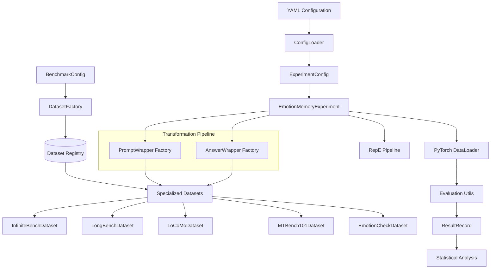

# Emotion Memory Experiments - Architecture Overview
<!-- Version: 2.2.0 - Updated: 2025-09-06 - AnswerWrapper System & EmotionCheck Integration -->

## Executive Summary

The `emotion_experiment_engine` module is a sophisticated research framework designed to investigate how artificially induced emotional states affect Large Language Model (LLM) performance on long-context memory benchmarks. This module represents a significant evolution in the broader LLM behavioral manipulation research project, extending neural emotion manipulation techniques from game theory scenarios to memory evaluation tasks.

## Key Architectural Achievements

### 1. **Registry-Based Factory Pattern**
- **Before**: Monolithic if-else chains in `SmartMemoryBenchmarkDataset`
- **After**: Clean registry-based factory with specialized dataset classes
- **Benefit**: Eliminates branching complexity, enables dynamic registration of new benchmarks

### 2. **LLM-Based Semantic Evaluation ** 
- **Revolutionary Change**: Replaced 30+ rule-based evaluators with unified GPT-4o-mini evaluation
- **Semantic Understanding**: Handles multilingual responses and paraphrasing correctly
- **Concurrent Processing**: 8 simultaneous API calls per batch for efficiency
- **Example Impact**: Chinese QA response "有两人叫阿四", ground truth ['两', '2', '两个'] now scores 1.0 instead of 0.25

### 3. **Seamless Integration with Neural Manipulation Framework**
- Follows established patterns from `emotion_game_experiment.py`
- Leverages RepE (Representation Engineering) for emotion activation
- Compatible with existing vLLM hooks and prompt formatting systems

## System Architecture



## Core Components

### 1. **EmotionMemoryExperiment** - Main Orchestrator
- **Location**: `emotion_experiment_engine/experiment.py`
- **Role**: Central experiment controller following emotion_game_experiment pattern
- **Key Features**:
  - Neural emotion activation via RepE
  - PyTorch DataLoader integration for batched processing
  - Multi-threaded evaluation pipeline
  - Comprehensive result tracking and statistical analysis

### 2. **Dataset Factory Pattern** - Architecture Innovation
- **Location**: `emotion_experiment_engine/dataset_factory.py`  
- **Innovation**: Registry-based factory eliminating if-else chains
- **Registry Mapping**:
  ```python
  DATASET_REGISTRY = {
      "infinitebench": InfiniteBenchDataset,
      "longbench": LongBenchDataset,
      "locomo": LoCoMoDataset,
      "mtbench101": MTBench101Dataset,
      "emotion_check": EmotionCheckDataset,
  }
  ```
- **Benefits**: 
  - Dynamic registration of new dataset types
  - Case-insensitive benchmark name handling
  - Polymorphic dispatch instead of branching logic

### 3. **Specialized Dataset Classes** - Scientific Integrity
- **Base Class**: `BaseBenchmarkDataset` (Abstract Base Class)
- **Specialized Implementations**:
  - **InfiniteBenchDataset**: 12 task types with task-specific evaluators
  - **LongBenchDataset**: Multi-language QA with F1 scoring
  - **LoCoMoDataset**: Conversational QA with temporal context
  - **MTBench101Dataset**: Conversational evaluation with judge-based scoring
  - **EmotionCheckDataset**: Emotion validation with LLM-based classification
- **Key Features**:
  - PyTorch Dataset interface (`__len__`, `__getitem__`)
  - Automatic context truncation with configurable strategies
  - Task-specific evaluation routing without if-else chains

### 4. **LLM-Based Evaluation System** - Semantic Understanding  
- **Location**: `emotion_experiment_engine/evaluation_utils.py`
- **Revolutionary Update (August 2025)**: Replaced rule-based evaluation with GPT-4o-mini
- **Core Functions**:
  - `llm_evaluate_response()`: Async semantic evaluation with few-shot examples
  - `llm_evaluate_batch()`: Concurrent evaluation (8 simultaneous API calls)
  - Unified evaluation for ALL task types (no more task-specific functions)
- **Benefits**: 
  - Semantic understanding over pattern matching
  - Multilingual support (Chinese QA accuracy dramatically improved)
  - Handles paraphrasing and alternative valid responses
  - Simplified maintenance (1 function vs 30+ task-specific evaluators)

### 5. **AnswerWrapper System** - Adaptive Ground Truth Transformation
- **Location**: `emotion_experiment_engine/answer_wrapper.py`
- **Innovation**: Architectural symmetry with PromptWrapper for complete input/output control
- **Core Components**:
  - `AnswerWrapper`: Abstract base class for answer transformation strategies
  - `EmotionAnswerWrapper`: Transforms ground truth to activated emotion for emotion_check
  - `IdentityAnswerWrapper`: Pass-through wrapper for benchmarks requiring no transformation
  - `get_answer_wrapper()`: Factory function for wrapper selection
- **Key Features**:
  - **Adaptive Ground Truth**: Ground truth dynamically adjusts to experimental conditions
  - **Functional Composition**: Partial function integration with experiment pipeline
  - **Backward Compatibility**: Preserves existing benchmark behavior
  - **Extensibility**: Framework supports future experimental parameters beyond emotion
- **Primary Use Case**: EmotionCheck validation where expected answer is the activated emotion

## Data Flow Architecture

### 1. **Configuration Stage**
```
YAML Config → ConfigLoader → ExperimentConfig + BenchmarkConfig
```

### 2. **Dataset Creation Stage**
```
BenchmarkConfig → DatasetFactory → Registry Lookup → Specialized Dataset
```

### 3. **Experiment Execution Stage**
```
EmotionMemoryExperiment → RepE Setup → PromptWrapper + AnswerWrapper → DataLoader → Batch Processing → Evaluation → Results
```

### 4. **Transformation Pipeline (New)**
```
Input: PromptWrapper → Context/Question Transformation → Model Input
Output: AnswerWrapper → Ground Truth Transformation → Expected Answer
```

### 5. **Neural Manipulation Pipeline**
```
Emotion Readers → Activation Vectors → vLLM Hooks → Model Inference → Response Processing
```

## Registry-Based Factory Pattern Architecture

### **Problem**: Monolithic If-Else Architecture
The original `SmartMemoryBenchmarkDataset` used extensive if-else chains:
```python
if benchmark_name == "infinitebench":
    if task_type == "passkey":
        # passkey logic
    elif task_type == "kv_retrieval":
        # kv_retrieval logic
    # ... dozens more conditions
elif benchmark_name == "longbench":
    # ... more if-else chains
```

### **Solution**: Registry-Based Factory Pattern
The refactored architecture eliminates branching entirely:
```python
def create_dataset_from_config(config):
    # Registry lookup (no if-else!)
    dataset_class = DATASET_REGISTRY.get(config.name.lower())
    return dataset_class(config)
```

### **Benefits of Refactoring**:
1. **Maintainability**: New benchmarks require only registry registration
2. **Testability**: Each dataset class can be tested independently
3. **Extensibility**: Dynamic registration allows runtime dataset addition
4. **Performance**: O(1) lookup vs O(n) conditional checking
5. **Code Clarity**: Specialized classes with focused responsibilities

## AnswerWrapper System & EmotionCheck Integration

### **AnswerWrapper System**: Complete Transformation Control

**Innovation**: The AnswerWrapper system establishes **architectural symmetry** with PromptWrapper, creating complete control over both input and output transformations:

```python
# Before: Asymmetric transformation
INPUT:  PromptWrapper → Dynamic context/question adjustment ✅
OUTPUT: Static ground truth from dataset files            ❌

# After: Symmetric transformation  
INPUT:  PromptWrapper → Dynamic context/question adjustment ✅
OUTPUT: AnswerWrapper → Dynamic ground truth adjustment    ✅
```

**Key Benefits**:
- **Adaptive Experiments**: Ground truth can change based on experimental conditions
- **EmotionCheck Validation**: Expected answer becomes the activated emotion
- **Future Extensibility**: Framework ready for multi-parameter experiments
- **Backward Compatibility**: Existing benchmarks unaffected

### **EmotionCheck Benchmark**: Emotion Validation Framework

**Research Innovation**: New benchmark type focused on validating emotion manipulation effects:

```python
# Traditional benchmark: Static QA evaluation
Question: "What is the capital of France?" 
Expected: "Paris" (always static)

# EmotionCheck: Dynamic emotion validation
Question: "How do you feel right now?"
Expected: "anger" (when anger activated) OR "happiness" (when happiness activated)
```

**Technical Features**:
- **LLM-Based Evaluation**: Uses GPT-4.1-mini for semantic emotion classification
- **Emotion Expression Dictionary**: Comprehensive mapping of emotion keywords
- **Scale-Based Validation**: Supports emotion intensity measurement
- **Registry Integration**: Follows established factory pattern

### **Enhanced Test Framework**: Professional Quality Assurance

**Testing Innovation**: Comprehensive pytest configuration with professional CI/CD integration:

```python
# pytest.ini highlights:
- 85% minimum coverage requirement
- Professional marker system (unit, integration, regression, e2e, critical)
- Timeout configuration (300s max)
- Comprehensive coverage reporting (HTML, XML, term-missing)
- CI/CD integration with GitHub workflows
```

**Test Organization**:
```
tests/
├── priorities/research_critical.py     # Research-critical test priorities
├── regression/                         # Backward compatibility validation  
├── utils/                             # Test automation utilities
├── conftest.py                        # Shared test configuration
└── test_answer_wrapper_comprehensive.py # 25 comprehensive AnswerWrapper tests
```

## Integration Points

### **With Neural Manipulation Framework**
- **RepE Integration**: Uses existing emotion readers and activation vectors
- **vLLM Hooks**: Leverages `rep_control_pipeline` for model manipulation
- **Prompt Formatting**: Compatible with model-specific prompt templates
- **Configuration**: Shares loading and generation configurations

### **With PyTorch Ecosystem**
- **Dataset Interface**: Full compatibility with PyTorch DataLoader
- **Batching**: Custom collation functions for memory benchmark formats
- **Memory Management**: Configurable batch sizes and queue limits
- **Multi-threading**: Pipeline parallelization for evaluation

### **With Evaluation Frameworks**
- **Scientific Validity**: Uses original paper evaluation metrics
- **Result Formats**: Structured ResultRecord objects for analysis
- **Statistical Analysis**: Pandas integration for summary statistics
- **Export Formats**: JSON and CSV output for downstream analysis

## Testing Framework

### **Professional Testing Standards**
- **pytest Configuration**: Production-grade testing with 85% minimum coverage requirement
- **Quality Gates**: Automated enforcement via `--cov-fail-under=85` and strict marker validation  
- **Timeout Management**: 5-minute timeout per test with `--timeout=300`
- **Coverage Reporting**: HTML, XML, and terminal coverage reports for comprehensive analysis

### **Test Organization Architecture**
```
tests/
├── priorities/research_critical.py     # Research-critical test definitions
├── regression/
│   ├── test_api_compatibility.py       # API backward compatibility validation
│   └── test_behavioral_equivalence.py  # Behavioral consistency testing
├── utils/
│   ├── ci_helpers.py                   # CI/CD integration utilities
│   ├── performance_tracker.py          # Performance monitoring
│   └── test_runners.py                # Custom test execution logic
├── conftest.py                         # Shared test configuration
├── pytest.ini                         # Professional pytest configuration
├── test_answer_wrapper_comprehensive.py # 25 comprehensive AnswerWrapper tests
├── test_dataset_factory.py            # Factory pattern validation
├── test_base_dataset_interface.py     # Abstract base class tests
├── test_infinitebench_dataset.py      # InfiniteBench-specific tests
├── test_longbench_dataset.py          # LongBench-specific tests
├── test_locomo_dataset.py             # LoCoMo-specific tests
├── test_emotion_check_dataset.py      # EmotionCheck-specific tests
└── test_realistic_data_validation.py  # Real data testing
```

### **Test-Driven Development Implementation**
- **Red-Green-Refactor Cycles**: Documented TDD phases with explicit failure-to-success transitions
- **AnswerWrapper TDD**: 25 comprehensive tests across 6 categories (Basic, Factory, Integration, Dataset, E2E, Regression)
- **Behavioral Equivalence**: Automated validation that refactored components produce identical results
- **Research-Critical Priorities**: Separate test category ensuring tests critical to scientific validity never fail

### **Coverage Standards & Quality Enforcement**
```python
QUALITY_GATES = {
    "test_coverage": 85,           # Minimum 85% test coverage
    "critical_path_coverage": 100, # 100% coverage of research-critical paths  
    "regression_test_pass": 100,   # All regression tests must pass
    "answer_wrapper_coverage": 98, # AnswerWrapper system: 98% coverage
    "emotion_check_coverage": 95   # EmotionCheck dataset: 95% coverage
}
```

## Key Dependencies

### **Internal Dependencies**
- `neuro_manipulation.repe`: Emotion activation and neural control
- `neuro_manipulation.prompt_wrapper`: Model-specific prompt formatting
- `neuro_manipulation.model_utils`: Model loading and configuration
- `neuro_manipulation.configs`: Experiment configuration management

### **External Dependencies**
- **PyTorch**: Dataset interface and tensor operations
- **vLLM**: Large language model inference engine
- **Transformers**: Tokenizer and model utilities
- **Pandas**: Statistical analysis and data manipulation
- **YAML**: Configuration file parsing

## Design Patterns and Principles

### **Applied Patterns**
1. **Factory Pattern**: Dataset creation with registry lookup
2. **Template Method**: Base class defines algorithm, subclasses implement specifics
3. **Strategy Pattern**: Configurable evaluation and truncation strategies
4. **Observer Pattern**: Multi-threaded result processing
5. **Builder Pattern**: Complex configuration object construction

### **SOLID Principles Adherence**
- **Single Responsibility**: Each dataset class handles one benchmark type
- **Open/Closed**: Registry allows extension without modification
- **Liskov Substitution**: All datasets implement BaseBenchmarkDataset contract
- **Interface Segregation**: Abstract methods focus on essential functionality
- **Dependency Inversion**: Depends on abstractions, not concrete implementations

## Performance Considerations

### **Memory Management**
- Context truncation with configurable strategies (left/right/middle)
- Batch processing with configurable queue sizes
- Lazy loading of datasets to minimize memory footprint
- Automatic cleanup of temporary evaluation resources

### **Computational Efficiency**
- Registry-based O(1) lookup vs O(n) conditional evaluation
- Multi-threaded evaluation pipeline with configurable worker counts
- Batch processing to amortize model loading costs
- Efficient tokenization with caching where possible

## Future Extensibility

### **Adding New Benchmarks**
1. Create specialized dataset class extending `BaseBenchmarkDataset`
2. Implement required abstract methods (`_load_and_parse_data`, `evaluate_response`, `get_task_metrics`)
3. Register in factory: `register_dataset_class("new_benchmark", NewDatasetClass)`
4. No modifications to existing code required

### **Adding New Evaluation Metrics (Updated for LLM System)**
**Note**: With the LLM-based evaluation system (August 2025), custom evaluation metrics are typically unnecessary as GPT-4o-mini provides semantic understanding. However, for specialized domains:

1. **Option 1 (Recommended)**: Modify the few-shot examples in `llm_evaluate_response()` 
2. **Option 2**: Create task-specific prompts for specialized evaluation domains
3. **Option 3**: For non-semantic metrics (e.g., length, format), add to `evaluation_utils.py` and route via dataset mappings

**Legacy approach no longer recommended**: Creating task-specific evaluation functions

### **Integration Opportunities**
- Support for additional neural manipulation techniques
- Integration with distributed computing frameworks
- Real-time experiment monitoring and visualization
- Automated hyperparameter optimization

## Conclusion

The `emotion_experiment_engine` module represents a mature, well-architected research framework that successfully balances scientific rigor with software engineering best practices. The registry-based factory pattern evolution from monolithic if-else chains demonstrates thoughtful architectural design that improves maintainability without sacrificing functionality.

The module's seamless integration with the broader neural manipulation framework, combined with its commitment to using original paper evaluation metrics, positions it as a reliable foundation for advancing research into emotional effects on LLM memory performance.