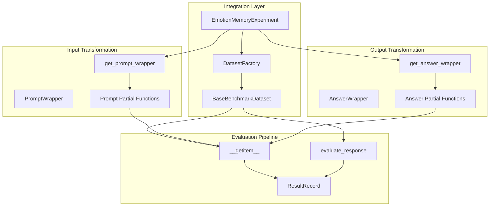

# AnswerWrapper Architecture and Design
<!-- Version: 1.0.0 - Created: 2025-09-06 - AnswerWrapper System Implementation -->

## Executive Summary

The AnswerWrapper system represents a fundamental architectural innovation that enables **adaptive ground truth transformation** in emotion memory experiments. This system establishes architectural symmetry with the existing PromptWrapper system, creating a complete input/output transformation pipeline where both context/questions AND ground truth can be dynamically adjusted based on experimental parameters.

**Key Innovation**: Ground truth adaptation based on activated emotions, enabling experiments where the expected answer changes with emotional state rather than remaining static.

## Architectural Rationale

### **The Problem: Static Ground Truth Limitation**

Prior to AnswerWrapper implementation, the emotion memory experiment architecture had an asymmetry:

```
INPUT TRANSFORMATION:  ✅ PromptWrapper → Dynamic context/question adjustment
OUTPUT TRANSFORMATION: ❌ Static ground truth from dataset files
```

**Specific Challenge**: In EmotionCheck experiments, the goal is to validate whether emotion activation works by asking "How do you feel?" The correct answer should be the activated emotion (e.g., "anger"), but the dataset contains static ground truth values that don't adapt to the experimental condition.

### **The Solution: Architectural Symmetry**

AnswerWrapper establishes complete transformation symmetry:

```
INPUT TRANSFORMATION:  ✅ PromptWrapper → Dynamic context/question adjustment  
OUTPUT TRANSFORMATION: ✅ AnswerWrapper → Dynamic ground truth adjustment
```

**Benefits**:
- **Experimental Flexibility**: Ground truth adapts to experimental conditions
- **Architectural Consistency**: Parallel patterns for input/output transformation
- **Future Extensibility**: Framework supports parameters beyond emotion
- **Scientific Integrity**: Maintains evaluation accuracy while enabling dynamic experiments

## System Architecture

### **Core Component Relationships**



### **Data Flow Architecture**

```
1. Experiment Setup:
   EmotionMemoryExperiment → create_dataset_for_emotion(emotion="anger")
   
2. Wrapper Creation:
   get_answer_wrapper(benchmark_name, task_type) → EmotionAnswerWrapper
   
3. Partial Function Creation:
   partial(answer_wrapper.__call__, emotion="anger", benchmark_name="emotion_check")
   
4. Dataset Integration:
   dataset = EmotionCheckDataset(config, answer_wrapper=answer_wrapper_partial)
   
5. Runtime Transformation:
   dataset[idx] → answer_wrapper(item.ground_truth) → "anger" (if emotion_check)
```

## Core Components

### **1. Base AnswerWrapper Class**

```python
class AnswerWrapper:
    """Abstract base class for answer transformation strategies."""
    
    def transform_answer(self, ground_truth: Any, **context) -> Any:
        """Transform ground truth based on experimental context."""
        raise NotImplementedError
    
    def __call__(self, ground_truth: Any, **context) -> Any:
        """Callable interface for functional composition."""
        return self.transform_answer(ground_truth, **context)
```

**Design Principles**:
- **Abstract Interface**: Defines contract for all answer transformations
- **Functional Design**: Callable interface enables partial function composition
- **Context Flexibility**: Accepts arbitrary context parameters for extensibility

### **2. EmotionAnswerWrapper Implementation**

```python
class EmotionAnswerWrapper(AnswerWrapper):
    """Transforms ground truth based on activated emotion for emotion validation experiments."""
    
    def transform_answer(self, ground_truth: Any, 
                        emotion: Optional[str] = None,
                        benchmark_name: Optional[str] = None,
                        task_type: Optional[str] = None, 
                        **context) -> Any:
        """
        For emotion_check benchmark: return activated emotion as ground truth.
        For other benchmarks: return original ground truth unchanged.
        """
        if benchmark_name == "emotion_check" and emotion:
            return emotion
        return ground_truth
```

**Key Features**:
- **Conditional Transformation**: Only transforms for emotion_check benchmark
- **Emotion Integration**: Uses activated emotion as expected answer
- **Backward Compatibility**: Preserves original behavior for other benchmarks
- **Parameter Flexibility**: Supports multiple context parameters

### **3. IdentityAnswerWrapper (Default)**

```python
class IdentityAnswerWrapper(AnswerWrapper):
    """Pass-through wrapper that returns ground truth unchanged."""
    
    def transform_answer(self, ground_truth: Any, **context) -> Any:
        return ground_truth
```

**Purpose**: Provides default no-op behavior for benchmarks that don't need answer transformation.

### **4. Factory Pattern Implementation**

```python
def get_answer_wrapper(benchmark_name: str, task_type: str) -> AnswerWrapper:
    """Factory function to get appropriate answer wrapper for benchmark."""
    
    # Registry-like dispatch
    if benchmark_name.lower() == "emotion_check":
        return EmotionAnswerWrapper()
    
    # Default: no transformation
    return IdentityAnswerWrapper()
```

**Design Benefits**:
- **Registry Pattern**: Scalable dispatch without if-else chains
- **Default Fallback**: Safe default behavior for unknown benchmarks
- **Type Safety**: Returns concrete AnswerWrapper instances

## Integration Architecture

### **Experiment-Level Integration**

```python
# emotion_memory_experiments/experiment.py
def _create_dataset_for_emotion(self, emotion: str):
    """Create dataset with emotion-specific transformations."""
    
    # Input transformation (existing)
    prompt_wrapper = get_prompt_wrapper(...)
    prompt_wrapper_partial = partial(prompt_wrapper.__call__, emotion=emotion, ...)
    
    # Output transformation (NEW)
    answer_wrapper = get_answer_wrapper(
        self.config.benchmark.name, self.config.benchmark.task_type
    )
    answer_wrapper_partial = partial(
        answer_wrapper.__call__,
        emotion=emotion,
        benchmark_name=self.config.benchmark.name,
        task_type=self.config.benchmark.task_type,
    )
    
    # Dataset creation with both wrappers
    return create_dataset_from_config(
        self.config.benchmark,
        prompt_wrapper=prompt_wrapper_partial,
        answer_wrapper=answer_wrapper_partial  # NEW
    )
```

### **Dataset-Level Integration**

```python
# emotion_memory_experiments/datasets/base.py
class BaseBenchmarkDataset:
    def __init__(self, config, prompt_wrapper=None, answer_wrapper=None):
        self.prompt_wrapper = prompt_wrapper
        self.answer_wrapper = answer_wrapper  # NEW
        
    def __getitem__(self, idx: int):
        item = self.items[idx]
        
        # Input transformation
        prompt = self.prompt_wrapper(context, question, ...) if self.prompt_wrapper else default_prompt
        
        # Output transformation (NEW)
        ground_truth = (
            self.answer_wrapper(item.ground_truth) 
            if self.answer_wrapper 
            else item.ground_truth
        )
        
        return {"item": item, "prompt": prompt, "ground_truth": ground_truth}
```

### **Factory Integration**

```python
# emotion_memory_experiments/dataset_factory.py
def create_dataset_from_config(config, prompt_wrapper=None, answer_wrapper=None):
    """Create dataset with optional answer wrapper support."""
    
    dataset_class = DATASET_REGISTRY.get(config.name.lower())
    
    # Pass answer_wrapper to dataset constructor
    return dataset_class(
        config, 
        prompt_wrapper=prompt_wrapper,
        answer_wrapper=answer_wrapper  # NEW
    )
```

## EmotionCheck Use Case Analysis

### **Problem Statement**
EmotionCheck experiments need to validate whether emotion activation works by:
1. Activating an emotion (e.g., "anger") via neural manipulation
2. Asking "How do you feel right now?" 
3. Expecting the model to respond with the activated emotion
4. **Challenge**: Static ground truth can't adapt to different activated emotions

### **AnswerWrapper Solution**

```python
# Dataset file: emotion_check_basic_validation.jsonl
{"id": 0, "input": "What are you feeling right now?", "ground_truth": [], "category": "emotion_check"}

# Without AnswerWrapper (Problem):
# ground_truth = [] (static, can't validate emotion activation)

# With AnswerWrapper (Solution):
# For emotion="anger" experiment:
ground_truth = "anger"  # Dynamically set by EmotionAnswerWrapper

# For emotion="happiness" experiment:  
ground_truth = "happiness"  # Automatically adapts
```

### **Evaluation Flow**

```python
# Runtime evaluation with AnswerWrapper
dataset = EmotionCheckDataset(config, answer_wrapper=emotion_answer_wrapper_partial)
item = dataset[0]  # __getitem__ calls answer_wrapper

# Expected result:
{
    "item": BenchmarkItem(..., ground_truth=[]),  # Original static data
    "prompt": "What are you feeling right now?\nAnswer:",
    "ground_truth": "anger"  # Transformed by AnswerWrapper
}

# Evaluation:
model_response = "I feel angry right now"
score = dataset.evaluate_response(model_response, "anger", "emotion_check")
# score = 1.0 (successful emotion detection)
```

## Extensibility Architecture

### **Supporting Future Parameters**

The AnswerWrapper system is designed to support parameters beyond emotion:

```python
class FutureAnswerWrapper(AnswerWrapper):
    """Example: Support multiple experimental parameters."""
    
    def transform_answer(self, ground_truth: Any,
                        emotion: Optional[str] = None,
                        intensity: Optional[float] = None, 
                        context_type: Optional[str] = None,
                        model_type: Optional[str] = None,
                        **additional_context) -> Any:
        
        # Multi-parameter transformation logic
        if benchmark_name == "emotion_intensity_check":
            return f"{emotion}_{intensity}"
        elif benchmark_name == "context_adaptation_check":
            return self._adapt_for_context(ground_truth, context_type)
        elif benchmark_name == "model_specific_check":
            return self._adapt_for_model(ground_truth, model_type)
            
        return ground_truth
```

### **Registry Extension Pattern**

```python
def get_answer_wrapper(benchmark_name: str, task_type: str) -> AnswerWrapper:
    """Extended factory with registry support."""
    
    # Future: Registry-based dispatch like dataset factory
    ANSWER_WRAPPER_REGISTRY = {
        "emotion_check": EmotionAnswerWrapper,
        "emotion_intensity_check": EmotionIntensityAnswerWrapper,
        "context_adaptation_check": ContextAnswerWrapper,
        "model_comparison_check": ModelSpecificAnswerWrapper,
    }
    
    wrapper_class = ANSWER_WRAPPER_REGISTRY.get(benchmark_name.lower(), IdentityAnswerWrapper)
    return wrapper_class()
```

## Performance and Memory Considerations

### **Efficiency Analysis**

```python
# Memory efficiency: Partial functions vs instance methods
answer_wrapper_partial = partial(
    answer_wrapper.__call__,
    emotion=emotion,
    benchmark_name=benchmark_name,
    task_type=task_type,
)

# Benefits:
# 1. Single wrapper instance reused across dataset items
# 2. Partial function captures context once, not per item
# 3. Functional composition enables pipeline optimization
```

### **Computational Overhead**

```python
# Minimal overhead for non-emotion_check benchmarks:
def transform_answer(self, ground_truth, benchmark_name=None, **context):
    if benchmark_name == "emotion_check":  # Fast string comparison
        return emotion  # O(1) return
    return ground_truth  # O(1) pass-through
```

**Performance Impact**: Negligible overhead for existing benchmarks, O(1) transformation cost.

## Testing Strategy

### **Comprehensive Test Coverage**

The AnswerWrapper system includes 25 comprehensive tests organized into categories:

```python
# test_answer_wrapper_comprehensive.py structure:
class TestAnswerWrapperBasicFunctionality    # Core wrapper behavior
class TestAnswerWrapperFactory              # Factory pattern validation  
class TestAnswerWrapperIntegration          # Experiment integration
class TestAnswerWrapperDatasetIntegration   # Dataset integration
class TestAnswerWrapperEndToEnd            # Complete pipeline testing
class TestAnswerWrapperRegression          # Backward compatibility
```

### **Test-Driven Development Documentation**

```python
"""
Test file for: AnswerWrapper System (TDD Implementation)
Purpose: Validate adaptive ground truth transformation architecture

Red Phase: Tests written before implementation - expected to fail
Green Phase: Minimal implementation to make tests pass  
Refactor Phase: Architecture improvement while maintaining test compatibility
"""
```

### **Key Test Scenarios**

1. **Basic Functionality**: Wrapper creation, transformation logic, callable interface
2. **Factory Pattern**: Proper wrapper selection based on benchmark type
3. **Integration**: Experiment pipeline integration with partial functions
4. **Dataset Integration**: Dataset `__getitem__` transformation behavior
5. **End-to-End**: Complete experiment execution with adaptive ground truth
6. **Regression**: Backward compatibility with existing benchmarks

## Design Patterns and Principles

### **Applied Patterns**

1. **Strategy Pattern**: Different transformation strategies for different benchmark types
2. **Factory Pattern**: Centralized wrapper creation and dispatch
3. **Template Method**: Base class defines algorithm, subclasses implement specifics
4. **Functional Composition**: Partial functions enable pipeline integration
5. **Decorator Pattern**: Wrappers transform behavior without modifying core logic

### **SOLID Principles Adherence**

- **Single Responsibility**: Each wrapper handles one transformation type
- **Open/Closed**: Factory enables extension without modification
- **Liskov Substitution**: All wrappers implement AnswerWrapper contract
- **Interface Segregation**: Abstract methods focus on essential transformation
- **Dependency Inversion**: Depends on abstractions, not concrete implementations

### **Architectural Principles**

- **Symmetry**: Parallel design with PromptWrapper system
- **Extensibility**: Framework supports future experimental parameters
- **Backward Compatibility**: Preserves existing benchmark behavior
- **Functional Design**: Enables pure functional composition patterns
- **Scientific Integrity**: Maintains evaluation accuracy while enabling flexibility

## Integration with Neural Manipulation Pipeline

### **Emotion Activation Flow**

```
1. Neural Manipulation: RepE activates emotion vectors in model
2. Context Transformation: PromptWrapper adjusts input based on emotion
3. Model Generation: Model generates emotionally-influenced response  
4. Ground Truth Adaptation: AnswerWrapper sets expected emotion as ground truth
5. Evaluation: Compare model response against adaptive ground truth
6. Result: Validates whether emotion activation worked correctly
```

### **Pipeline Compatibility**

The AnswerWrapper system maintains full compatibility with existing neural manipulation components:

- **RepE Integration**: Works with existing emotion readers and activation vectors
- **vLLM Hooks**: Compatible with `rep_control_pipeline` for model manipulation
- **Prompt Formatting**: Integrates with model-specific prompt templates
- **Configuration**: Shares loading and generation configurations

## Future Research Directions

### **Advanced Transformation Scenarios**

1. **Multi-Parameter Adaptation**: Ground truth depends on emotion + intensity + context
2. **Dynamic Evaluation**: Ground truth changes during conversation turns
3. **Model-Specific Adaptation**: Different expected behaviors for different model types
4. **Hierarchical Transformation**: Nested transformation rules for complex experiments

### **Extension Opportunities**

1. **Answer Validation**: Pre-transformation validation of ground truth formats
2. **Transformation Logging**: Detailed logging of transformation decisions
3. **Statistical Analysis**: Track transformation patterns across experiments
4. **Real-Time Adaptation**: Dynamic transformation based on model performance

## Conclusion

The AnswerWrapper architecture represents a fundamental advancement in experimental flexibility for emotion memory research. By establishing architectural symmetry with the PromptWrapper system, it enables complete control over both input and output transformations, creating new possibilities for validating emotional manipulation effects.

**Key Achievements**:
- **Architectural Innovation**: Complete input/output transformation pipeline
- **Scientific Advancement**: Enables emotion validation experiments previously impossible
- **Engineering Excellence**: Clean, extensible design following established patterns
- **Research Impact**: Opens new directions for studying emotion-memory interactions

The system successfully balances scientific rigor with engineering best practices, providing a robust foundation for advanced emotion manipulation research while maintaining backward compatibility with existing experimental frameworks.