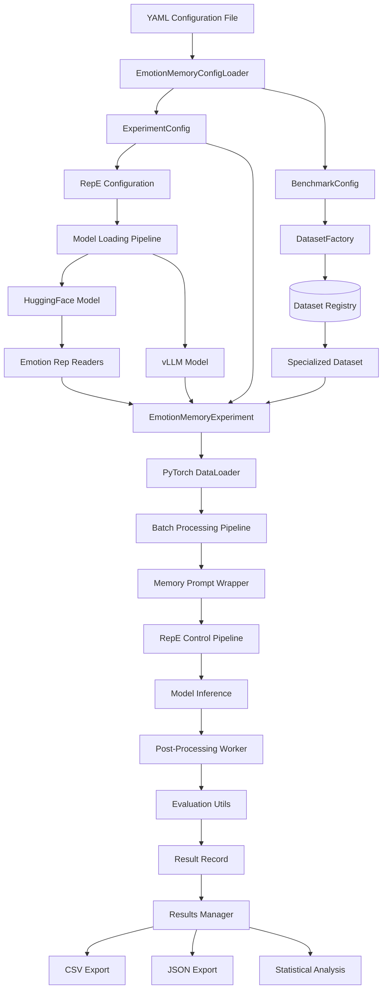

# Data Flow and Integration Points Analysis
<!-- Version: 1.5.0 - Updated: 2025-01-02 - Universal Benchmark Prompt Wrapper Factory -->

## Overview

The emotion memory experiments module operates through a sophisticated data flow that integrates multiple subsystems: configuration management, neural manipulation, dataset processing, model inference, and evaluation. This analysis traces the complete data flow from experiment configuration to final results, highlighting critical integration points and architectural dependencies.

## Complete Data Flow Architecture



## Stage-by-Stage Data Flow Analysis

### **Stage 1: Configuration Loading and Parsing**

#### **Input**: YAML Configuration File
```yaml
experiment:
  name: "Emotion_Memory_Benchmark_Experiment"
  model_path: "/path/to/model"
  emotions: ["anger", "happiness", "neutral"]
  intensities: [0.5, 1.0, 1.5]
  
  benchmark:
    name: "infinitebench"
    task_type: "passkey"
    data_path: "data/infinitebench_passkey.jsonl"
    sample_limit: 100
    
  generation_config:
    temperature: 0.1
    max_new_tokens: 100
    do_sample: false
```

#### **Processing**: EmotionMemoryConfigLoader
```python
@staticmethod
def _parse_config(yaml_config: Dict[str, Any]) -> ExperimentConfig:
    """Parse YAML into structured configuration objects"""
    config = yaml_config.get('experiment', {})
    
    # Create benchmark configuration
    benchmark_section = config.get('benchmark', {})
    benchmark_config = BenchmarkConfig(
        name=benchmark_section.get('name', 'infinitebench'),
        data_path=Path(benchmark_section.get('data_path', '')),
        task_type=benchmark_section.get('task_type', 'passkey'),
        sample_limit=benchmark_section.get('sample_limit', None)
    )
    
    # Create experiment configuration
    return ExperimentConfig(
        model_path=config.get('model_path'),
        emotions=config.get('emotions', ['anger', 'happiness']),
        intensities=config.get('intensities', [1.0]),
        benchmark=benchmark_config,
        output_dir=config.get('output', {}).get('base_dir', 'results'),
        batch_size=config.get('batch_size', 4),
        generation_config=config.get('generation_config', {})
    )
```

#### **Output**: Structured Configuration Objects
- `ExperimentConfig`: High-level experiment parameters
- `BenchmarkConfig`: Dataset-specific configuration with context processing settings
- `VLLMLoadingConfig`: Model loading parameters with extensible vLLM arguments
- `Generation Config`: Inference parameters

### **Stage 2: Dataset Factory and Specialization**

#### **Input**: BenchmarkConfig
```python
benchmark_config = BenchmarkConfig(
    name="infinitebench",
    task_type="passkey", 
    data_path=Path("data/infinitebench_passkey.jsonl"),
    sample_limit=100
)
```

#### **Processing**: Registry-Based Factory
```python
def create_dataset_from_config(config: BenchmarkConfig) -> BaseBenchmarkDataset:
    """Factory creates specialized dataset via registry lookup"""
    
    # O(1) registry lookup (no if-else chains!)
    benchmark_name = config.name.lower().strip()
    dataset_class = DATASET_REGISTRY.get(benchmark_name)  # InfiniteBenchDataset
    
    # Polymorphic instantiation with all parameters
    return dataset_class(
        config=config,
        prompt_wrapper=prompt_wrapper,
        max_context_length=max_context_length,
        tokenizer=tokenizer,
        truncation_strategy=truncation_strategy
    )
```

#### **Output**: Specialized Dataset Instance
```python
dataset = InfiniteBenchDataset(
    config=benchmark_config,
    # Implements BaseBenchmarkDataset interface
    # Contains InfiniteBench-specific evaluation logic
    # Provides PyTorch Dataset interface (__len__, __getitem__)
)
```

### **Stage 3: Neural Manipulation Setup**

#### **Two-Stage Model Loading Process**

##### **Stage 3a: Emotion Reader Extraction**
```python
# Load HuggingFace model for layer access
model, tokenizer, prompt_format, processor = setup_model_and_tokenizer(
    loading_config, from_vllm=False  # Use HF for emotion readers
)

# Extract emotion activation vectors from model layers
emotion_rep_readers = load_emotion_readers(
    repe_config,
    model,           # HF model with accessible layers
    tokenizer,
    hidden_layers,   # [-1, -2, -3, ..., -num_layers]
    processor,
    enable_thinking
)

# Result: Dictionary mapping emotions to RepReader objects
# emotion_rep_readers = {
#     "anger": RepReader(directions, direction_signs, ...),
#     "happiness": RepReader(directions, direction_signs, ...),
#     "neutral": RepReader(directions, direction_signs, ...)
# }

del model  # Free memory after extraction
```

##### **Stage 3b: Inference Model Loading**
```python
# Load vLLM model for efficient inference
model, tokenizer, prompt_format, _ = setup_model_and_tokenizer(
    loading_config, from_vllm=True  # Use vLLM for inference
)

# Create RepE control pipeline
rep_control_pipeline = get_pipeline(
    "rep-control-vllm",
    model=model,                # vLLM LLM instance
    tokenizer=tokenizer,
    layers=middle_layers,       # Middle third of hidden layers
    block_name=repe_config["block_name"],
    control_method=repe_config["control_method"],
)
```

#### **Integration Point**: RepE Configuration
```python
repe_config = get_repe_eng_config(
    model_path, 
    yaml_config=experiment_config.repe_eng_config
)
# Contains: control_method, block_name, layer specifications
# Used by: emotion reader extraction, control pipeline setup
```

### **Stage 4: Prompt Wrapper Integration**

#### **Universal Benchmark Prompt Formatting**
```python
# Create benchmark prompt wrapper using universal factory
from emotion_memory_experiments.benchmark_prompt_wrapper import get_benchmark_prompt_wrapper

benchmark_prompt_wrapper = get_benchmark_prompt_wrapper(
    benchmark_name="mtbench101",    # From benchmark config  
    task_type="CM",                 # From benchmark config
    prompt_format=prompt_format     # From model loading
)

# Legacy memory benchmark support
memory_prompt_wrapper = get_benchmark_prompt_wrapper(
    benchmark_name="infinitebench", # Supports infinitebench, longbench, locomo
    task_type="passkey",            # From benchmark config
    prompt_format=prompt_format     # From model loading
)

# Create partial function with experiment-specific parameters
memory_prompt_wrapper_partial = partial(
    memory_prompt_wrapper.__call__,
    user_messages="Please provide your answer.",
    enable_thinking=enable_thinking,
    augmentation_config=benchmark_config.augmentation_config,
)
```

#### **Integration with neuro_manipulation Framework**
```python
class MemoryPromptWrapper(PromptWrapper):
    """Extends neuro_manipulation.prompt_wrapper.PromptWrapper"""
    
    def __call__(self, context, question, user_messages, enable_thinking, augmentation_config):
        # Leverages parent class prompt formatting
        # Adds memory-specific context handling
        # Supports answer augmentation for retrieval experiments
        
        if augmentation_config and answer:
            # Mark answer in context for retrieval experiments
            context = context.replace(answer, f"{prefix}{answer}{suffix}")
        
        # Use parent class for model-specific formatting
        return super().format_prompt(
            system_prompt=self.system_prompt(context, question),
            user_messages=self.user_messages(user_messages),
            enable_thinking=enable_thinking
        )
```

### **Stage 5: Experiment Execution Pipeline**

#### **Multi-Emotion, Multi-Intensity Loop**
```python
def run_experiment(self) -> pd.DataFrame:
    """Main experiment execution coordinating all components"""
    all_results = []
    
    # Iterate through emotion-intensity combinations
    for emotion in self.config.emotions:  # ["anger", "happiness"]
        rep_reader = self.emotion_rep_readers[emotion]
        self.cur_emotion = emotion
        
        # Fresh DataLoader for each emotion (prevents data leakage)
        data_loader = self.build_dataloader()
        
        for intensity in self.config.intensities:  # [0.5, 1.0, 1.5]
            self.cur_intensity = intensity
            
            # Process with emotion activation
            results = self._infer_with_activation(rep_reader, data_loader)
            all_results.extend(results)
    
    # Neutral baseline (no emotion activation)
    neutral_results = self._infer_with_activation(rep_reader, data_loader)
    all_results.extend(neutral_results)
    
    return self._save_results(all_results)
```

#### **DataLoader Construction and Integration**
```python
def build_dataloader(self) -> DataLoader:
    """Integrate dataset factory with PyTorch DataLoader"""
    
    # Create specialized dataset via factory
    self.dataset = create_dataset_from_config(
        self.config.benchmark,
        prompt_wrapper=self.memory_prompt_wrapper_partial,
        max_context_length=self.max_context_length,
        tokenizer=self.tokenizer,
        truncation_strategy=self.truncation_strategy
    )
    
    # PyTorch DataLoader with custom collation
    return DataLoader(
        self.dataset, 
        collate_fn=self.dataset.collate_fn,  # Dataset-specific collation
        batch_size=self.batch_size,
        shuffle=False  # Preserve order for reproducibility
    )
```

### **Stage 6: Neural Activation and Inference Pipeline**

#### **Activation Vector Computation**
```python
def _infer_with_activation(self, rep_reader, data_loader):
    """Setup emotion-specific activation vectors"""
    
    if self.cur_emotion == "neutral" or self.cur_intensity == 0.0:
        activations = {}  # No activation for neutral baseline
    else:
        # Compute activation vectors for each layer
        device = torch.device("cpu") if self.is_vllm else self.model.device
        activations = {
            layer: torch.tensor(
                self.cur_intensity              # Intensity scaling
                * rep_reader.directions[layer]  # Direction vector
                * rep_reader.direction_signs[layer]  # Sign correction
            ).to(device).half()
            for layer in self.hidden_layers  # All applicable layers
        }
    
    return self._forward_dataloader(data_loader, activations)
```

#### **Multi-threaded Inference Pipeline**
```python
def _forward_dataloader(self, data_loader, activations):
    """Parallel inference and post-processing pipeline"""
    
    pipeline_queue = Queue(maxsize=2)  # Memory control
    processed_futures = []
    
    def pipeline_worker():
        """Background inference thread"""
        for batch_idx, batch in enumerate(data_loader):
            # Apply RepE control during inference
            control_outputs = self.rep_control_pipeline(
                batch["prompt"],                    # Formatted prompts
                activations=activations,            # Emotion vectors
                batch_size=self.batch_size,
                **self.generation_config           # Model parameters
            )
            pipeline_queue.put((batch_idx, batch, control_outputs))
        pipeline_queue.put(None)  # Sentinel
    
    # Start background inference
    worker = Thread(target=pipeline_worker)
    worker.start()
    
    # Parallel post-processing
    with ThreadPoolExecutor(max_workers=self.batch_size // 2) as executor:
        while True:
            item = pipeline_queue.get()
            if item is None: break
            
            batch_idx, batch, control_outputs = item
            
            # Submit evaluation to thread pool
            future = executor.submit(
                self._post_process_memory_batch, 
                batch, control_outputs, batch_idx
            )
            processed_futures.append((batch_idx, future))
        
        # Collect results maintaining order
        results_dict = {}
        for batch_idx, future in processed_futures:
            results_dict[batch_idx] = future.result()
        
        # Combine in order
        batch_results = []
        for i in sorted(results_dict.keys()):
            batch_results.extend(results_dict[i])
    
    worker.join()
    return batch_results
```

### **Stage 7: Evaluation and Post-Processing**

#### **Benchmark-Specific Evaluation**
```python
def _post_process_memory_batch(self, batch, control_outputs, batch_idx):
    """Evaluate responses using specialized dataset methods"""
    results = []
    
    for prompt, item, ground_truth, output in zip(
        batch["prompt"], batch["items"], batch["ground_truths"], control_outputs
    ):
        # Extract response from model output
        if self.is_vllm:
            response = output.outputs[0].text.replace(prompt, "").strip()
        else:
            response = output[0]["generated_text"].replace(prompt, "").strip()
        
        # Use dataset's specialized evaluation method
        try:
            score = self.dataset.evaluate_response(
                response, ground_truth, self.config.benchmark.task_type
            )
        except Exception as e:
            self.logger.warning(f"Evaluation error: {e}")
            score = 0.0
        
        # Create structured result record
        result = ResultRecord(
            emotion=self.cur_emotion,
            intensity=self.cur_intensity,
            item_id=item.id,
            task_name=self.config.benchmark.task_type,
            prompt=prompt,
            response=response,
            ground_truth=ground_truth,
            score=score,
            metadata={
                "benchmark": self.config.benchmark.name,
                "item_metadata": item.metadata or {},
            }
        )
        results.append(result)
    
    return results
```

#### **Evaluation Routing (InfiniteBench Example)**
```python
class InfiniteBenchDataset:
    def evaluate_response(self, response: str, ground_truth: Any, task_name: str) -> float:
        """Route to task-specific evaluator"""
        
        # Static routing table (eliminates if-else chains)
        evaluator_name = self.TASK_EVALUATORS.get(task_name)  # "get_score_one_passkey"
        
        if not evaluator_name:
            # Fallback for unknown tasks
            return float(get_score_one(response, ground_truth, task_name, "emotion_model"))
        
        # Dynamic function lookup and execution
        evaluator_func = getattr(evaluation_utils, evaluator_name)
        result = evaluator_func(response, ground_truth, "emotion_model")
        return float(result)
```

### **Stage 8: Results Management and Analysis**

#### **Comprehensive Result Serialization**
```python
def _save_results(self, results: List[ResultRecord]) -> pd.DataFrame:
    """Save experiment results with multiple output formats"""
    
    # Convert to DataFrame for analysis
    df = pd.DataFrame([
        {
            "emotion": result.emotion,
            "intensity": result.intensity,
            "item_id": result.item_id,
            "task_name": result.task_name,
            "response": result.response,
            "ground_truth": str(result.ground_truth),
            "score": result.score,
            "benchmark": result.metadata.get("benchmark", ""),
        }
        for result in results
    ])
    
    # Multiple output formats
    self.output_dir.mkdir(parents=True, exist_ok=True)
    
    # Detailed CSV for analysis
    df.to_csv(self.output_dir / "detailed_results.csv", index=False)
    
    # Raw JSON with full metadata
    with open(self.output_dir / "raw_results.json", "w") as f:
        json.dump([result.__dict__ for result in results], f, indent=2, default=str)
    
    # Statistical summary
    summary = (
        df.groupby(["emotion", "intensity"])
        .agg({"score": ["mean", "std", "count", "min", "max"]})
        .round(4)
    )
    summary.to_csv(self.output_dir / "summary_results.csv")
    
    return df
```

#### **Configuration Persistence for Reproducibility**
```python
def _save_experiment_config(self):
    """Save complete configuration for experiment reproduction"""
    
    config_dict = {
        # Core experiment parameters
        "model_path": self.config.model_path,
        "emotions": self.config.emotions,
        "intensities": self.config.intensities,
        
        # Benchmark configuration
        "benchmark": {
            "name": self.config.benchmark.name,
            "data_path": str(self.config.benchmark.get_data_path()),
            "task_type": self.config.benchmark.task_type,
            "sample_limit": self.config.benchmark.sample_limit,
        },
        
        # Model and generation settings
        "generation_config": self.generation_config,
        "loading_config": self._serialize_loading_config(),
        "repe_eng_config": self.repe_config,
        
        # Runtime information
        "runtime_info": {
            "timestamp": datetime.now().isoformat(),
            "max_context_length": self.max_context_length,
            "truncation_strategy": self.truncation_strategy,
            "hidden_layers": self.hidden_layers,
            "is_vllm": self.is_vllm,
        }
    }
    
    with open(self.output_dir / "experiment_config.json", "w") as f:
        json.dump(config_dict, f, indent=2, default=str)
```

## Critical Integration Points

### **1. Configuration System Integration**
- **Entry Point**: YAML configuration files
- **Processing**: EmotionMemoryConfigLoader 
- **Output**: Structured dataclass objects
- **Integration Challenge**: Backward compatibility with different configuration formats
- **Solution**: Flexible parsing with legacy support

### **2. Dataset Factory Integration**
- **Entry Point**: BenchmarkConfig objects
- **Processing**: Registry-based factory dispatch
- **Output**: Specialized dataset instances
- **Integration Challenge**: Maintaining PyTorch Dataset interface
- **Solution**: Abstract base class enforcing common interface

### **3. Neural Manipulation Framework Integration**
- **Entry Point**: Model path and RepE configuration
- **Processing**: Two-stage model loading (HF → vLLM)
- **Output**: Emotion readers and control pipeline
- **Integration Challenge**: Memory management with large models
- **Solution**: Sequential loading with explicit cleanup

### **4. Prompt Formatting Integration**
- **Entry Point**: Task type and model format requirements
- **Processing**: Task-specific prompt wrapper creation
- **Output**: Formatted prompts compatible with model expectations
- **Integration Challenge**: Supporting different model architectures
- **Solution**: Extensible prompt wrapper inheritance

### **5. Evaluation System Integration**
- **Entry Point**: Model responses and ground truth data
- **Processing**: Task-specific evaluation routing
- **Output**: Standardized numerical scores
- **Integration Challenge**: Maintaining scientific validity across benchmarks
- **Solution**: Exact replication of original paper evaluation methods

### **6. Results Pipeline Integration**
- **Entry Point**: Individual result records
- **Processing**: Statistical analysis and multiple export formats
- **Output**: CSV, JSON, and summary files
- **Integration Challenge**: Handling large result datasets efficiently
- **Solution**: Streaming processing and configurable output formats

## Data Transformation Points

### **Configuration → Execution Objects**
```python
# YAML String → Python Objects → Experiment State
yaml_config → ExperimentConfig → EmotionMemoryExperiment
yaml_config → BenchmarkConfig → Specialized Dataset (with context processing)
yaml_config → VLLMLoadingConfig → Model Loading Parameters (with extensible vLLM args)
```

### **Raw Data → Structured Items**
```python
# File Data → Benchmark Items → DataLoader Batches
JSONL/JSON → List[BenchmarkItem] → DataLoader → Batch Dict
```

### **Model Outputs → Evaluation Scores**  
```python
# Model Responses → Evaluation → Structured Results
GenerationOutput → Response String → Float Score → ResultRecord
```

### **Results → Analysis Formats**
```python
# Result Objects → Analysis Formats → Statistical Summaries
List[ResultRecord] → pandas.DataFrame → CSV/JSON → Statistical Summary
```

## Performance and Scalability Considerations

### **Memory Management**
- **Context Truncation**: Automatic handling of long contexts with configurable strategies
- **Batch Processing**: Configurable batch sizes to balance memory usage and throughput
- **Queue Management**: Limited pipeline queues to prevent memory overflow
- **Model Cleanup**: Explicit memory cleanup between model loading stages

### **Computational Efficiency**
- **Registry Lookup**: O(1) dataset selection vs O(n) conditional evaluation
- **Multi-threading**: Parallel inference and evaluation to maximize resource utilization
- **Batched Inference**: Amortized model loading costs across multiple samples
- **Lazy Loading**: Dataset items loaded on-demand to minimize memory footprint

### **Scalability Features**
- **Configurable Parallelism**: Adjustable worker thread counts
- **Streaming Results**: Results processed and saved incrementally
- **Modular Architecture**: Easy to distribute across multiple processes/machines
- **Resource Monitoring**: Comprehensive logging for performance analysis

## Error Handling and Resilience

### **Configuration Validation**
- **Schema Validation**: Type checking and required field validation
- **Path Validation**: Existence checks for data files and model paths  
- **Parameter Validation**: Range checking for numerical parameters

### **Runtime Error Handling**
- **Evaluation Failures**: Graceful degradation with 0.0 scores
- **Model Errors**: Retry mechanisms and error logging
- **Resource Exhaustion**: Queue management and memory monitoring

### **Recovery Mechanisms**
- **Partial Results**: Experiment continues even with individual item failures
- **Checkpoint Support**: Configuration saved for experiment reproduction
- **Logging Integration**: Comprehensive error context for debugging

## Conclusion

The emotion memory experiments module demonstrates sophisticated data flow orchestration that successfully integrates multiple complex subsystems while maintaining clean architectural boundaries. The data flow design achieves:

1. **Configuration Flexibility**: Multiple input formats with backward compatibility
2. **Processing Efficiency**: Registry-based dispatch and parallel processing pipelines  
3. **Scientific Rigor**: Original paper evaluation methods with comprehensive validation
4. **Integration Seamlessness**: Clean interfaces with existing neural manipulation framework
5. **Result Completeness**: Multiple output formats with full reproducibility information

The architecture's strength lies in its clear separation of concerns and well-defined integration points, enabling each subsystem to be developed, tested, and maintained independently while functioning cohesively as part of the larger research framework.