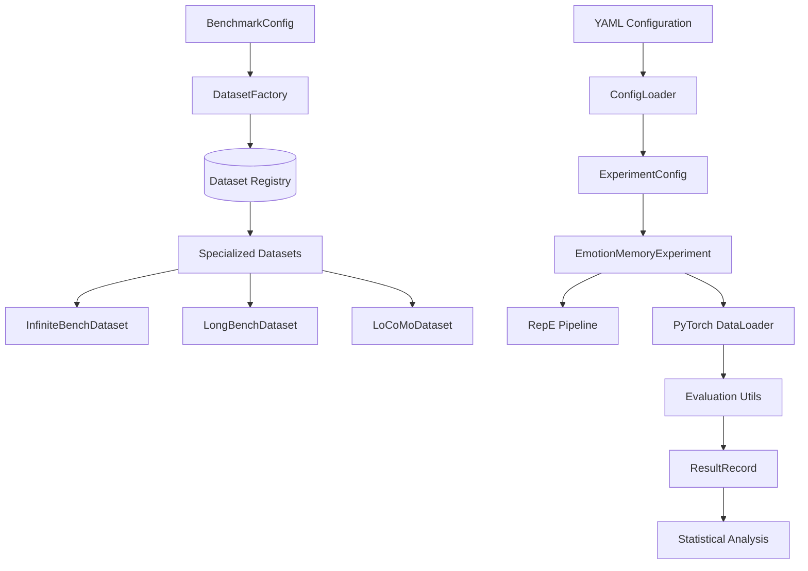

# Emotion Memory Experiments - Architecture Overview

## Executive Summary

The `emotion_memory_experiments` module is a sophisticated research framework designed to investigate how artificially induced emotional states affect Large Language Model (LLM) performance on long-context memory benchmarks. This module represents a significant evolution in the broader LLM behavioral manipulation research project, extending neural emotion manipulation techniques from game theory scenarios to memory evaluation tasks.

## Key Architectural Achievements

### 1. **Registry-Based Factory Pattern (Recent Refactoring)**
- **Before**: Monolithic if-else chains in `SmartMemoryBenchmarkDataset`
- **After**: Clean registry-based factory with specialized dataset classes
- **Benefit**: Eliminates branching complexity, enables dynamic registration of new benchmarks

### 2. **LLM-Based Semantic Evaluation ** 
- **Revolutionary Change**: Replaced 30+ rule-based evaluators with unified GPT-4o-mini evaluation
- **Semantic Understanding**: Handles multilingual responses and paraphrasing correctly
- **Concurrent Processing**: 8 simultaneous API calls per batch for efficiency
- **Example Impact**: Chinese QA response "有两人叫阿四", ground truth ['两', '2', '两个'] now scores 1.0 instead of 0.25

### 3. **Seamless Integration with Neural Manipulation Framework**
- Follows established patterns from `emotion_game_experiment.py`
- Leverages RepE (Representation Engineering) for emotion activation
- Compatible with existing vLLM hooks and prompt formatting systems

## System Architecture



## Core Components

### 1. **EmotionMemoryExperiment** - Main Orchestrator
- **Location**: `emotion_memory_experiments/experiment.py`
- **Role**: Central experiment controller following emotion_game_experiment pattern
- **Key Features**:
  - Neural emotion activation via RepE
  - PyTorch DataLoader integration for batched processing
  - Multi-threaded evaluation pipeline
  - Comprehensive result tracking and statistical analysis

### 2. **Dataset Factory Pattern** - Architecture Innovation
- **Location**: `emotion_memory_experiments/dataset_factory.py`  
- **Innovation**: Registry-based factory eliminating if-else chains
- **Registry Mapping**:
  ```python
  DATASET_REGISTRY = {
      "infinitebench": InfiniteBenchDataset,
      "longbench": LongBenchDataset,
      "locomo": LoCoMoDataset,
  }
  ```
- **Benefits**: 
  - Dynamic registration of new dataset types
  - Case-insensitive benchmark name handling
  - Polymorphic dispatch instead of branching logic

### 3. **Specialized Dataset Classes** - Scientific Integrity
- **Base Class**: `BaseBenchmarkDataset` (Abstract Base Class)
- **Specialized Implementations**:
  - **InfiniteBenchDataset**: 12 task types with task-specific evaluators
  - **LongBenchDataset**: Multi-language QA with F1 scoring
  - **LoCoMoDataset**: Conversational QA with temporal context
- **Key Features**:
  - PyTorch Dataset interface (`__len__`, `__getitem__`)
  - Automatic context truncation with configurable strategies
  - Task-specific evaluation routing without if-else chains

### 4. **LLM-Based Evaluation System** - Semantic Understanding  
- **Location**: `emotion_memory_experiments/evaluation_utils.py`
- **Revolutionary Update (August 2025)**: Replaced rule-based evaluation with GPT-4o-mini
- **Core Functions**:
  - `llm_evaluate_response()`: Async semantic evaluation with few-shot examples
  - `llm_evaluate_batch()`: Concurrent evaluation (8 simultaneous API calls)
  - Unified evaluation for ALL task types (no more task-specific functions)
- **Benefits**: 
  - Semantic understanding over pattern matching
  - Multilingual support (Chinese QA accuracy dramatically improved)
  - Handles paraphrasing and alternative valid responses
  - Simplified maintenance (1 function vs 30+ task-specific evaluators)

## Data Flow Architecture

### 1. **Configuration Stage**
```
YAML Config → ConfigLoader → ExperimentConfig + BenchmarkConfig
```

### 2. **Dataset Creation Stage**
```
BenchmarkConfig → DatasetFactory → Registry Lookup → Specialized Dataset
```

### 3. **Experiment Execution Stage**
```
EmotionMemoryExperiment → RepE Setup → DataLoader → Batch Processing → Evaluation → Results
```

### 4. **Neural Manipulation Pipeline**
```
Emotion Readers → Activation Vectors → vLLM Hooks → Model Inference → Response Processing
```

## Recent Refactoring Analysis

### **Problem**: Monolithic If-Else Architecture
The original `SmartMemoryBenchmarkDataset` used extensive if-else chains:
```python
if benchmark_name == "infinitebench":
    if task_type == "passkey":
        # passkey logic
    elif task_type == "kv_retrieval":
        # kv_retrieval logic
    # ... dozens more conditions
elif benchmark_name == "longbench":
    # ... more if-else chains
```

### **Solution**: Registry-Based Factory Pattern
The refactored architecture eliminates branching entirely:
```python
def create_dataset_from_config(config):
    # Registry lookup (no if-else!)
    dataset_class = DATASET_REGISTRY.get(config.name.lower())
    return dataset_class(config)
```

### **Benefits of Refactoring**:
1. **Maintainability**: New benchmarks require only registry registration
2. **Testability**: Each dataset class can be tested independently
3. **Extensibility**: Dynamic registration allows runtime dataset addition
4. **Performance**: O(1) lookup vs O(n) conditional checking
5. **Code Clarity**: Specialized classes with focused responsibilities

## Integration Points

### **With Neural Manipulation Framework**
- **RepE Integration**: Uses existing emotion readers and activation vectors
- **vLLM Hooks**: Leverages `rep_control_pipeline` for model manipulation
- **Prompt Formatting**: Compatible with model-specific prompt templates
- **Configuration**: Shares loading and generation configurations

### **With PyTorch Ecosystem**
- **Dataset Interface**: Full compatibility with PyTorch DataLoader
- **Batching**: Custom collation functions for memory benchmark formats
- **Memory Management**: Configurable batch sizes and queue limits
- **Multi-threading**: Pipeline parallelization for evaluation

### **With Evaluation Frameworks**
- **Scientific Validity**: Uses original paper evaluation metrics
- **Result Formats**: Structured ResultRecord objects for analysis
- **Statistical Analysis**: Pandas integration for summary statistics
- **Export Formats**: JSON and CSV output for downstream analysis

## Testing Strategy

### **Comprehensive Test Coverage**
- **Unit Tests**: Individual component validation
- **Integration Tests**: End-to-end experiment execution
- **Behavioral Equivalence**: Refactored vs original behavior validation
- **Real Data Validation**: Testing against actual benchmark datasets

### **Test Structure**
```
tests/
├── test_dataset_factory.py      # Factory pattern validation
├── test_base_dataset_interface.py  # Abstract base class tests
├── test_infinitebench_dataset.py   # InfiniteBench-specific tests  
├── test_longbench_dataset.py       # LongBench-specific tests
├── test_locomo_dataset.py          # LoCoMo-specific tests
├── test_comprehensive_evaluation.py # End-to-end testing
├── test_behavioral_equivalence.py  # Refactoring validation
└── test_realistic_data_validation.py # Real data testing
```

### **TDD Approach**
- Tests written following Test-Driven Development principles
- Red-Green-Refactor cycle documentation
- Regression testing after refactoring
- Mock data generation for controlled testing

## Key Dependencies

### **Internal Dependencies**
- `neuro_manipulation.repe`: Emotion activation and neural control
- `neuro_manipulation.prompt_wrapper`: Model-specific prompt formatting
- `neuro_manipulation.model_utils`: Model loading and configuration
- `neuro_manipulation.configs`: Experiment configuration management

### **External Dependencies**
- **PyTorch**: Dataset interface and tensor operations
- **vLLM**: Large language model inference engine
- **Transformers**: Tokenizer and model utilities
- **Pandas**: Statistical analysis and data manipulation
- **YAML**: Configuration file parsing

## Design Patterns and Principles

### **Applied Patterns**
1. **Factory Pattern**: Dataset creation with registry lookup
2. **Template Method**: Base class defines algorithm, subclasses implement specifics
3. **Strategy Pattern**: Configurable evaluation and truncation strategies
4. **Observer Pattern**: Multi-threaded result processing
5. **Builder Pattern**: Complex configuration object construction

### **SOLID Principles Adherence**
- **Single Responsibility**: Each dataset class handles one benchmark type
- **Open/Closed**: Registry allows extension without modification
- **Liskov Substitution**: All datasets implement BaseBenchmarkDataset contract
- **Interface Segregation**: Abstract methods focus on essential functionality
- **Dependency Inversion**: Depends on abstractions, not concrete implementations

## Performance Considerations

### **Memory Management**
- Context truncation with configurable strategies (left/right/middle)
- Batch processing with configurable queue sizes
- Lazy loading of datasets to minimize memory footprint
- Automatic cleanup of temporary evaluation resources

### **Computational Efficiency**
- Registry-based O(1) lookup vs O(n) conditional evaluation
- Multi-threaded evaluation pipeline with configurable worker counts
- Batch processing to amortize model loading costs
- Efficient tokenization with caching where possible

## Future Extensibility

### **Adding New Benchmarks**
1. Create specialized dataset class extending `BaseBenchmarkDataset`
2. Implement required abstract methods (`_load_and_parse_data`, `evaluate_response`, `get_task_metrics`)
3. Register in factory: `register_dataset_class("new_benchmark", NewDatasetClass)`
4. No modifications to existing code required

### **Adding New Evaluation Metrics (Updated for LLM System)**
**Note**: With the LLM-based evaluation system (August 2025), custom evaluation metrics are typically unnecessary as GPT-4o-mini provides semantic understanding. However, for specialized domains:

1. **Option 1 (Recommended)**: Modify the few-shot examples in `llm_evaluate_response()` 
2. **Option 2**: Create task-specific prompts for specialized evaluation domains
3. **Option 3**: For non-semantic metrics (e.g., length, format), add to `evaluation_utils.py` and route via dataset mappings

**Legacy approach no longer recommended**: Creating task-specific evaluation functions

### **Integration Opportunities**
- Support for additional neural manipulation techniques
- Integration with distributed computing frameworks
- Real-time experiment monitoring and visualization
- Automated hyperparameter optimization

## Conclusion

The `emotion_memory_experiments` module represents a mature, well-architected research framework that successfully balances scientific rigor with software engineering best practices. The recent refactoring from monolithic if-else chains to a registry-based factory pattern demonstrates thoughtful architectural evolution that improves maintainability without sacrificing functionality.

The module's seamless integration with the broader neural manipulation framework, combined with its commitment to using original paper evaluation metrics, positions it as a reliable foundation for advancing research into emotional effects on LLM memory performance.