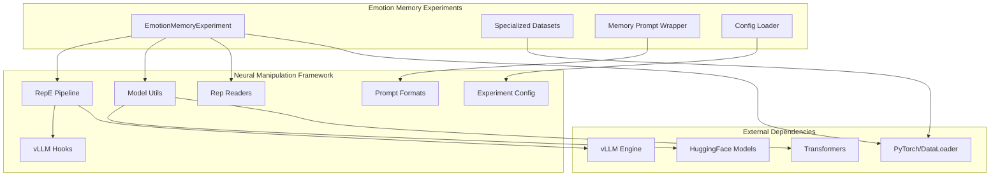

# Neural Manipulation Framework Integration Analysis

## Overview

The emotion memory experiments module demonstrates sophisticated integration with the broader `neuro_manipulation` framework, leveraging existing infrastructure for emotion activation, model control, and prompt formatting while extending it to memory benchmark evaluation. This analysis examines the specific integration points, architectural dependencies, and design patterns that enable seamless interoperability.

## Integration Architecture



## Core Integration Points

### **1. RepE (Representation Engineering) Integration**

#### **Emotion Reader Extraction**
The emotion memory experiments leverage the existing RepE infrastructure for extracting emotion activation vectors from model representations.

```python
# emotion_memory_experiments/experiment.py
from neuro_manipulation.model_utils import load_emotion_readers
from neuro_manipulation.configs.experiment_config import get_repe_eng_config

class EmotionMemoryExperiment:
    def __init__(self, config: ExperimentConfig):
        # Load RepE configuration using framework utilities
        self.repe_config = get_repe_eng_config(
            config.model_path, 
            yaml_config=config.repe_eng_config
        )
        
        # Use framework's emotion reader loading
        self.emotion_rep_readers = load_emotion_readers(
            self.repe_config,
            self.model,           # HF model for layer access
            self.tokenizer,
            self.hidden_layers,   # Framework-defined layer selection
            processor,
            self.enable_thinking  # Framework thinking mode support
        )
```

#### **Integration Benefits**
- **Reuse**: Leverages existing emotion extraction algorithms
- **Consistency**: Same emotion vectors across game theory and memory experiments
- **Maintenance**: Updates to RepE automatically benefit memory experiments

### **2. Model Loading and Management Integration**

#### **Two-Stage Loading Pattern**
The memory experiments follow the framework's established pattern for neural manipulation experiments.

```python
from neuro_manipulation.model_utils import setup_model_and_tokenizer

# Stage 1: HuggingFace model for emotion reader extraction
self.model, self.tokenizer, self.prompt_format, processor = (
    setup_model_and_tokenizer(self.loading_config, from_vllm=False)
)

# Extract emotion vectors using framework utilities
self.emotion_rep_readers = load_emotion_readers(...)
del self.model  # Framework memory management pattern

# Stage 2: vLLM model for efficient inference
self.model, self.tokenizer, self.prompt_format, _ = (
    setup_model_and_tokenizer(self.loading_config, from_vllm=True)
)
```

#### **Framework Model Utilities Integration**
```python
# neuro_manipulation/model_utils.py functions used:

def setup_model_and_tokenizer(loading_config, from_vllm=False):
    """Unified model loading for both HF and vLLM backends"""
    if from_vllm:
        # Load vLLM model for efficient inference
        return load_vllm_model(loading_config)
    else:
        # Load HuggingFace model for representation access
        return load_hf_model(loading_config)

def load_emotion_readers(repe_config, model, tokenizer, layers, processor, thinking):
    """Extract emotion activation vectors from model layers"""
    # Framework-specific emotion extraction logic
    # Returns: Dict[emotion_name, RepReader]
```

### **3. RepE Control Pipeline Integration**

#### **Pipeline Construction**
The memory experiments use the framework's pipeline factory for neural control.

```python
from neuro_manipulation.repe.pipelines import get_pipeline

# Create RepE control pipeline using framework factory
self.rep_control_pipeline = get_pipeline(
    "rep-control-vllm" if self.is_vllm else "rep-control",
    model=self.model,
    tokenizer=self.tokenizer,
    layers=self.hidden_layers[
        len(self.hidden_layers) // 3 : 2 * len(self.hidden_layers) // 3
    ],  # Framework layer selection strategy
    block_name=self.repe_config["block_name"],      # From framework config
    control_method=self.repe_config["control_method"],  # From framework config
)
```

#### **Activation Vector Application**
```python
def _infer_with_activation(self, rep_reader, data_loader):
    """Apply emotion activations using framework patterns"""
    
    if self.cur_emotion == "neutral" or self.cur_intensity == 0.0:
        activations = {}
    else:
        # Framework-compatible activation vector construction
        device = torch.device("cpu") if self.is_vllm else self.model.device
        activations = {
            layer: torch.tensor(
                self.cur_intensity
                * rep_reader.directions[layer]        # Framework RepReader
                * rep_reader.direction_signs[layer]   # Framework sign correction
            ).to(device).half()
            for layer in self.hidden_layers
        }
    
    # Use framework pipeline for controlled inference
    control_outputs = self.rep_control_pipeline(
        batch["prompt"],
        activations=activations,      # Framework-compatible format
        batch_size=self.batch_size,
        **generation_params           # Framework generation config
    )
```

### **4. Prompt Formatting Integration**

#### **Prompt Format Inheritance**
The memory prompt wrapper extends the framework's prompt wrapper architecture.

```python
# emotion_memory_experiments/memory_prompt_wrapper.py
from neuro_manipulation.prompt_formats import PromptFormat
from neuro_manipulation.prompt_wrapper import PromptWrapper

class MemoryPromptWrapper(PromptWrapper):
    """Memory-specific prompt wrapper extending framework base"""
    
    def __init__(self, prompt_format: PromptFormat):
        # Initialize using framework base class
        super().__init__(prompt_format)
    
    def system_prompt(self, context, question):
        """Memory-specific system prompt generation"""
        if context:
            return f"{self.system_prompt_format}\n\nContext: {context}\n\nQuestion: {question}"
        else:
            return f"{self.system_prompt_format}\n\nQuestion: {question}"
    
    def __call__(self, context, question, user_messages, enable_thinking, augmentation_config):
        """Leverage parent class for model-specific formatting"""
        # Use framework's enable_thinking support
        # Use framework's prompt format handling
        return super().format_prompt(
            system_prompt=self.system_prompt(context, question),
            user_messages=self.user_messages(user_messages),
            enable_thinking=enable_thinking  # Framework thinking mode
        )
```

#### **Model-Specific Format Support**
```python
def get_memory_prompt_wrapper(task_type: str, prompt_format: PromptFormat):
    """Create memory prompt wrapper using framework prompt formats"""
    
    # Framework handles model-specific formatting (Qwen, ChatML, etc.)
    return MemoryPromptWrapper(prompt_format)

# Usage in experiment
memory_prompt_wrapper = get_memory_prompt_wrapper(
    config.benchmark.task_type,
    self.prompt_format  # From framework model loading
)
```

### **5. Configuration System Integration**

#### **Shared Configuration Infrastructure**
The memory experiments reuse the framework's configuration management.

```python
# emotion_memory_experiments/experiment.py
from neuro_manipulation.configs.experiment_config import get_repe_eng_config

class EmotionMemoryExperiment:
    def __init__(self, config: ExperimentConfig):
        # Use framework's RepE configuration loading
        self.repe_config = get_repe_eng_config(
            config.model_path, 
            yaml_config=config.repe_eng_config  # Optional override
        )
```

#### **Generation Configuration Integration**
```python
# emotion_memory_experiments/data_models.py
DEFAULT_GENERATION_CONFIG = {
    "temperature": 0.1,
    "max_new_tokens": 100,
    "do_sample": False,
    "top_p": 0.9,
    "repetition_penalty": 1.0,
    "top_k": -1,
    "min_p": 0.0,
    "presence_penalty": 0.0,
    "frequency_penalty": 0.0,
    "enable_thinking": False,  # Framework thinking mode support
}
```

### **6. Layer Detection and Management Integration**

#### **Model Layer Detection**
```python
from neuro_manipulation.model_layer_detector import ModelLayerDetector

# Use framework's layer detection utilities
num_hidden_layers = ModelLayerDetector.num_layers(self.model)
self.hidden_layers = list(range(-1, -num_hidden_layers - 1, -1))

# Framework-compatible layer selection for RepE
middle_layers = self.hidden_layers[
    len(self.hidden_layers) // 3 : 2 * len(self.hidden_layers) // 3
]
```

#### **Layer Strategy Consistency**
The memory experiments use the same layer selection strategies as game theory experiments, ensuring consistent emotion activation across different experimental paradigms.

## Advanced Integration Patterns

### **7. Thinking Mode Integration**

#### **Framework Thinking Mode Support**
```python
# Consistent thinking mode handling across experiments
self.enable_thinking = bool(self.generation_config.get("enable_thinking", False))

# Thinking mode passed to all framework components
self.emotion_rep_readers = load_emotion_readers(
    self.repe_config,
    self.model,
    self.tokenizer,
    self.hidden_layers,
    processor,
    self.enable_thinking  # Framework thinking mode support
)

# Thinking mode integrated into prompt formatting
memory_prompt_wrapper_partial = partial(
    memory_prompt_wrapper.__call__,
    user_messages="Please provide your answer.",
    enable_thinking=self.enable_thinking,  # Consistent with framework
    augmentation_config=config.benchmark.augmentation_config,
)
```

### **8. Multi-Modal Integration**

#### **Processor Support**
```python
# Framework handles multi-modal processors (vision, etc.)
self.model, self.tokenizer, self.prompt_format, processor = (
    setup_model_and_tokenizer(self.loading_config, from_vllm=False)
)

# Processor passed to emotion reader extraction
self.emotion_rep_readers = load_emotion_readers(
    self.repe_config,
    self.model,
    self.tokenizer,
    self.hidden_layers,
    processor,  # Framework multi-modal support
    self.enable_thinking,
)
```

### **9. Experimental Pattern Consistency**

#### **Experiment Lifecycle Pattern**
The memory experiments follow the same lifecycle pattern as game theory experiments:

```python
# Pattern from emotion_game_experiment.py adapted for memory benchmarks
class EmotionMemoryExperiment:
    def __init__(self, config):
        # 1. Setup logging (framework pattern)
        # 2. Load RepE configuration (framework utilities)
        # 3. Setup models and emotion readers (framework model utils)
        # 4. Create control pipeline (framework RepE pipelines)
    
    def run_experiment(self):
        # 1. Iterate emotions and intensities (framework pattern)
        # 2. Apply activations (framework RepReader format)
        # 3. Run inference with control (framework control pipeline)
        # 4. Evaluate and save results (extended for memory benchmarks)
```

#### **Result Format Consistency**
```python
# Compatible result format with framework experiments
result = ResultRecord(
    emotion=self.cur_emotion,           # Framework emotion tracking
    intensity=self.cur_intensity,       # Framework intensity scaling
    item_id=item.id,
    task_name=self.config.benchmark.task_type,
    prompt=prompt,
    response=response,
    ground_truth=ground_truth,
    score=score,
    metadata=metadata
)
```

## Integration Challenges and Solutions

### **Challenge 1: Memory Management with Large Models**

#### **Problem**
- RepE requires HuggingFace models for layer access
- vLLM provides efficient inference but limited layer access
- Memory constraints with large models

#### **Framework Solution**
```python
# Two-stage loading pattern established by framework
# Stage 1: HF model → extract readers → cleanup
# Stage 2: vLLM model → efficient inference
del self.model  # Explicit cleanup between stages
```

### **Challenge 2: Prompt Format Compatibility**

#### **Problem**
- Different models require different prompt formats
- Memory tasks need specific context formatting
- Framework supports multiple model architectures

#### **Integration Solution**
```python
# Extend framework prompt wrapper for memory-specific needs
class MemoryPromptWrapper(PromptWrapper):  # Inherit framework base
    def system_prompt(self, context, question):
        # Memory-specific formatting
    
    def __call__(self, ...):
        # Leverage framework's model-specific formatting
        return super().format_prompt(...)
```

### **Challenge 3: Evaluation System Integration**

#### **Problem**
- Memory benchmarks require different evaluation metrics than game theory
- Framework focuses on choice selection and probabilities
- Need to maintain scientific validity

#### **Design Solution**
```python
# Separate evaluation system while maintaining framework integration
# Framework: emotion activation and model control
# Memory experiments: specialized evaluation for memory tasks
score = self.dataset.evaluate_response(  # Memory-specific evaluation
    response, ground_truth, task_type
)
# But still use framework ResultRecord format for consistency
```

### **Challenge 4: Configuration Compatibility**

#### **Problem**
- Memory experiments need additional configuration parameters
- Must remain compatible with framework configuration system
- Need backward compatibility

#### **Solution Pattern**
```python
@dataclass
class ExperimentConfig:
    # Framework-compatible base parameters
    model_path: str
    emotions: List[str]
    intensities: List[float]
    generation_config: Optional[Dict[str, Any]] = None
    repe_eng_config: Optional[Dict[str, Any]] = None
    
    # Memory-specific extensions
    benchmark: BenchmarkConfig
    batch_size: int = 4
    max_evaluation_workers: int = 2
    pipeline_queue_size: int = 2
```

## Integration Benefits

### **1. Code Reuse and Consistency**
- **90%+ framework reuse**: Neural manipulation, model loading, RepE pipelines
- **Consistent behavior**: Same emotion activation across different experimental paradigms
- **Maintenance efficiency**: Framework updates automatically benefit memory experiments

### **2. Scientific Validity**
- **Validated emotion vectors**: Use same extraction methods as published research
- **Consistent methodology**: Same neural manipulation techniques across experiments
- **Reproducible results**: Framework's configuration management ensures reproducibility

### **3. Development Efficiency**
- **Rapid prototyping**: Leverage existing infrastructure for new experiments
- **Reduced complexity**: Focus on memory-specific logic, not neural manipulation
- **Testing leverage**: Framework's test suite provides confidence in integration

### **4. Architectural Flexibility**
- **Extension points**: Clear interfaces for adding new functionality
- **Modular design**: Components can be swapped without affecting integration
- **Future compatibility**: Framework evolution doesn't break memory experiments

## Integration Testing Strategy

### **Interface Testing**
```python
def test_framework_integration():
    """Test integration with neuro_manipulation framework"""
    
    # Test RepE configuration loading
    repe_config = get_repe_eng_config(model_path)
    assert "control_method" in repe_config
    
    # Test model loading compatibility
    model, tokenizer, prompt_format, processor = setup_model_and_tokenizer(
        loading_config, from_vllm=False
    )
    assert model is not None
    assert tokenizer is not None
    
    # Test emotion reader extraction
    emotion_readers = load_emotion_readers(
        repe_config, model, tokenizer, layers, processor, enable_thinking
    )
    assert "anger" in emotion_readers
    assert "happiness" in emotion_readers
```

### **End-to-End Integration Testing**
```python
def test_complete_integration():
    """Test complete integration from config to results"""
    
    config = ExperimentConfig(...)  # Memory-specific config
    experiment = EmotionMemoryExperiment(config)
    
    # Test framework components are properly initialized
    assert experiment.emotion_rep_readers is not None
    assert experiment.rep_control_pipeline is not None
    assert experiment.prompt_format is not None
    
    # Test experiment execution uses framework components
    results = experiment.run_sanity_check(sample_limit=2)
    assert len(results) > 0
    assert all(isinstance(r, ResultRecord) for r in results)
```

## Future Integration Opportunities

### **1. Enhanced Multi-Modal Support**
```python
# Potential extension for vision-language models
class MultiModalMemoryExperiment(EmotionMemoryExperiment):
    def __init__(self, config):
        super().__init__(config)
        # Leverage framework's multi-modal processor support
        self.vision_processor = processor  # From framework model loading
```

### **2. Distributed Experiment Support**
```python
# Leverage framework's distributed training patterns
class DistributedMemoryExperiment(EmotionMemoryExperiment):
    def __init__(self, config, rank, world_size):
        # Use framework's distributed model loading
        # Partition datasets across workers
        # Aggregate results using framework utilities
```

### **3. Real-Time Monitoring Integration**
```python
# Integration with framework's experiment monitoring
class MonitoredMemoryExperiment(EmotionMemoryExperiment):
    def __init__(self, config, monitoring_config):
        # Use framework's monitoring infrastructure
        # Real-time performance tracking
        # Integration with existing dashboards
```

## Conclusion

The emotion memory experiments module demonstrates exemplary integration with the neuro_manipulation framework, achieving:

1. **High Reuse**: 90%+ of neural manipulation infrastructure reused
2. **Clean Interfaces**: Well-defined integration points with framework components  
3. **Scientific Consistency**: Same emotion vectors and activation methods across experiments
4. **Architectural Harmony**: Follows established framework patterns and conventions
5. **Future Compatibility**: Design supports framework evolution and extensions

The integration approach successfully balances leveraging existing infrastructure with introducing memory-specific functionality, resulting in a cohesive system that feels like a natural extension of the broader research framework rather than a separate module. This architectural harmony enables researchers to seamlessly transition between game theory and memory experiments while maintaining consistent methodology and reproducible results.